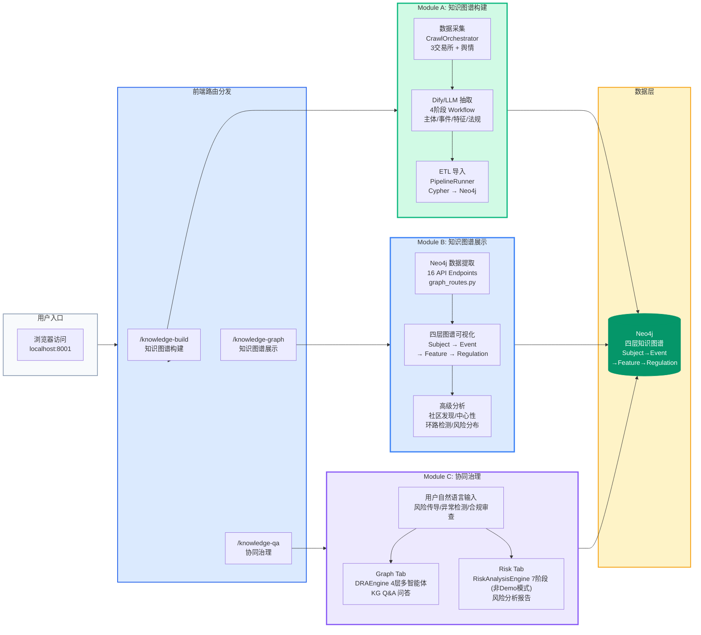
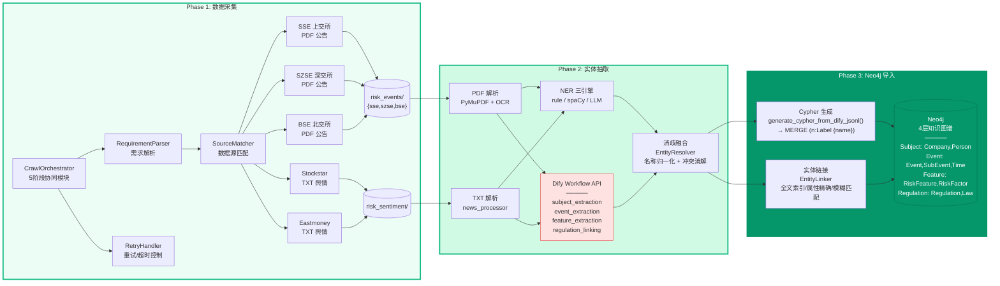
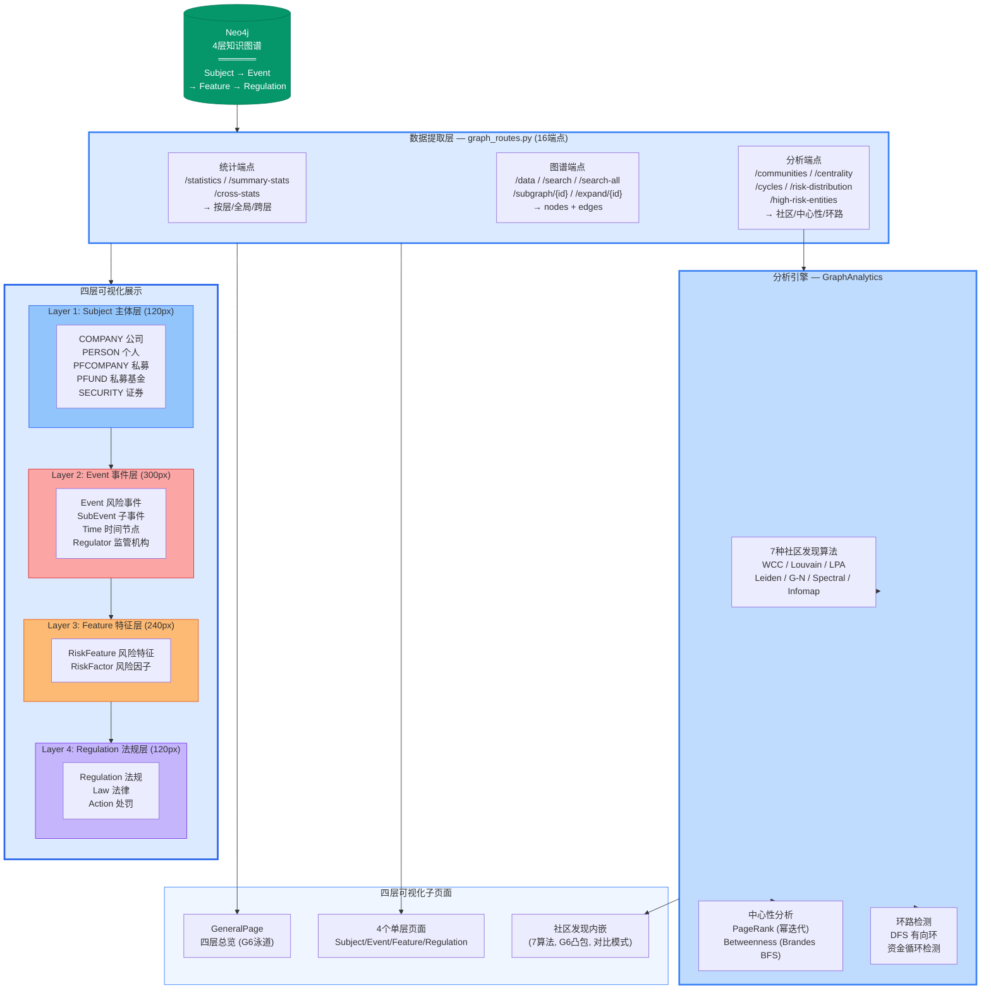
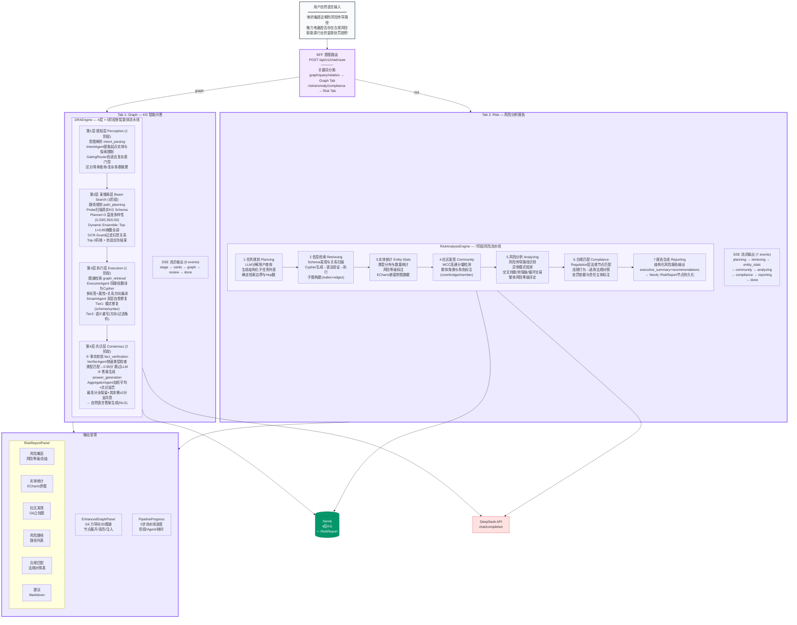

---
name: windeye
description: "WindEye project context and operations. Use when working on any part of the WindEye capital markets risk monitoring platform — backend API, frontend UI, scraper/crawler, knowledge graph, ETL pipeline, or risk analysis."
---
# WindEye — 资本市场风险传导监测平台

## 快速启动

```powershell
.\start.ps1                              # 一键启动
cd backend; python -m uvicorn main:app --host 0.0.0.0 --port 8000 --reload
cd frontend; $env:PORT='8001'; npm run dev
```

- 前端: `http://localhost:8001` | 后端: `http://localhost:8000` | API 文档: `http://localhost:8000/docs`

---

## 一、系统架构总览

```
┌── Frontend (React 19 + Ant Design Pro v6 + UmiJS Max 4) :8001
│   ├── Welcome              风险仪表盘 (ECharts)
│   ├── KnowledgeQA           协同治理 (SSE 流式聊天, Route→Graph/Risk)
│   ├── KnowledgeBuild        知识图谱构建 (ETL 向导 + 采集)
│   ├── KnowledgeGraph        四层图谱可视化 (G6 泳道, 4层 + 社区发现)
│   └── DataCollection        采集入口 (快速/复杂/模板模式)
│
│   config/proxy.ts ── /api/* → :8000 ──────────────────────┐
│                                                            ▼
├── Backend (Python FastAPI) :8000
│   ├── main.py                   入口，创建 DRAEngine + RiskAnalysisEngine
│   ├── api/router.py             路由工厂 create_routes() [Module C 核心]
│   ├── api/graph_routes.py       图谱可视化 API [Module B 核心]
│   └── api/pipeline_routes.py    采集/ETL API [Module A 核心]
│
│   ┌── 引擎层 ──────────────────────────────────────────────
│   ├── DRAEngine (dra_ma/orchestrator/engine.py)       [C]
│   │   └── 4层×5阶段: 感知层→束搜索层→执行层→共识层 → SSE 流式输出
│   ├── RiskAnalysisEngine (dra_ma/risk_engine/)        [C]
│   │   └── 7阶段: 任务规划→信息检索→实体统计→社区发现→风险分析→合规匹配→报告生成
│   ├── CrawlOrchestrator (data_collection/)            [A]
│   │   └── 5阶段多 Agent 协同爬取 → 文件落地
│   └── PipelineRunner (kg_construction/etl/)           [A]
│       └── 7阶段 ETL → Cypher → Neo4j
│
│   ┌── 技能/分析层 ────────────────────────────────────────
│   ├── SkillManager (dra_ma/skills/)                   [C]
│   │   └── 26 Hook点, 5个活跃技能, 消融实验支持
│   ├── GraphAnalytics (kg_query/analytics/)            [B]
│   │   └── 7种社区发现算法, PageRank, Betweenness, 环路检测
│   ├── OntologyRegistry (kg_construction/ontology/)    [ALL]
│   │   └── 本体驱动的 Cypher 生成, 四层KG Schema
│   └── DifyClient (data_collection/dify/)              [A]
│       └── Dify 工作流 API 封装, 按阶段分离 Key
│
├── Neo4j (bolt://localhost:7687)                       [ALL]
│   └── 四层知识图谱: Subject → Event → Feature → Regulation
│
└── External APIs
    ├── DeepSeek API (LLM, chat/embedding)               [C]
    └── Dify Workflow API (法规抽取)                      [A]
```

### 整体技术栈

| 层级     | 技术                                  | 说明                                                |
| -------- | ------------------------------------- | --------------------------------------------------- |
| 前端框架 | React 19 + UmiJS Max 4 + TypeScript 5 | Ant Design Pro v6, 页面级代码分割                   |
| 前端状态 | Zustand (3个Store)                    | agentStore(问答), chatStore(会话), crawlStore(采集) |
| 前端渲染 | AntV G6 v4 + ECharts v6               | G6 图谱可视化, ECharts 统计分析                     |
| 后端框架 | Python FastAPI + Uvicorn              | 异步 SSE 流式, Pydantic 模型                        |
| 数据库   | Neo4j (bolt://localhost:7687)         | 四层图谱存储, 全文索引, 向量索引                    |
| LLM      | DeepSeek API (OpenAI 兼容)            | DRAEngine + RiskAnalysisEngine + NER                |

### 四层知识图谱 Schema

```
Subject ──→ Event ──→ Feature ──→ Regulation
  主体          事件          特征            法规

Subject:  Company, Person, PFCompany, PFund, Security
Event:    Event, SubEvent, Time, Regulator
Feature:  RiskFeature, RiskFactor
Regulation: Regulation, Law, Action, PartyWithResponsibility
```

### 三大模块概览

| 模块                      | 开发者      | 前端路由             | 核心职责                                          |
| ------------------------- | ----------- | -------------------- | ------------------------------------------------- |
| **A: 知识图谱构建** | Developer A | `/knowledge-build` | 数据采集 → NER/Dify 抽取 → ETL → Neo4j         |
| **B: 知识图谱展示** | Developer B | `/knowledge-graph` | 四层图谱可视化, 社区发现, 中心性/环路分析         |
| **C: 协同治理**     | Developer C | `/knowledge-qa`    | KG Q&A (DRAEngine), 风险分析 (RiskAnalysisEngine) |

---


## 架构图 (Mermaid) — 端到端数据流

### 图0: 系统总览 — 输入 → 三大模块全景



### 图1: Module A — 知识图谱构建 (爬虫 → Dify → Neo4j)



### 图2: Module B — 四层知识图谱展示 (数据提取 → 四层展示)



### 图3: Module C — 协同治理 (用户输入 → 两Tab → 多智能体分析 → 输出)



| 图 | 内容 | 核心流程 |
|---|---|---|
| 图0 | 系统总览 | 输入 → 路由分发 → Module A/B/C → Neo4j |
| 图1 | Module A: 知识图谱构建 | 爬虫(5源) → Dify(4阶段) → Cypher → Neo4j |
| 图2 | Module B: 四层图谱展示 | Neo4j → 16API → GraphAnalytics → 四层可视化 |
| 图3 | Module C: 协同治理 | 用户输入 → 意图路由 → Graph/Risk Tab → SSE输出 |


## 二、Module A: 知识图谱构建

```
                            ┌─ 前端 ─────────────────────┐
                            │  KnowledgeBuild (index.tsx)  │
                            │  ┌─ 数据导入 Tab ──────────┐ │
                            │  │ 文件上传 | 源扫描 | ETL │ │
                            │  ├─ 智能采集 Tab ──────────┤ │
                            │  │ Quick/Complex/Template  │ │
                            │  └─ 阶段抽取 (2-5) ────────┘ │
                            │  G6 图谱预览 → 确认导入 Neo4j │
                            └──────────────────────────────┘
                                      │ SSE / REST
                                      ▼
┌─────────────────────────────────────────────────────────────┐
│  后端 API: api/pipeline_routes.py                           │
│  ├── POST /crawl/run        CrawlOrchestrator (SSE 流式)    │
│  ├── POST /crawl/parse-nl   NL 意图预解析                    │
│  ├── POST /run              完整 ETL PipelineRunner          │
│  ├── POST /extract/{stage}  按阶段 Dify 抽取                 │
│  └── POST /dify/import      Dify 抽取 + Neo4j 导入          │
└─────────────────────────────────────────────────────────────┘
                    │                        │
                    ▼                        ▼
┌──────────────────────────┐  ┌──────────────────────────────┐
│ CrawlOrchestrator        │  │ PipelineRunner               │
│ orchestrator.py          │  │ etl/pipeline_runner.py        │
│                          │  │                              │
│ 5阶段流水线:              │  │ 7阶段 ETL:                    │
│ 1. RequirementParsing    │  │ 1. Crawl (爬取)              │
│ 2. SourceMatching        │  │ 2. Parse (解析)              │
│ 3. Scraper Execution     │  │ 3. Extract (NER/Dify 双路径) │
│ 4. Quality Assessment    │  │ 4. Link (实体链接)           │
│ 5. Auto-trigger ETL      │  │ 5. Resolve (消歧融合)        │
│                          │  │ 6. Import (Cypher → Neo4j)   │
│ 3种模式:                  │  │ 7. Index (索引构建)          │
│ QUICK / COMPLEX / TEMPLATE│  │                              │
│                          │  │ extraction_method:            │
│ Demo → Mock 文件          │  │ "default"(NER) 或 "dify"     │
│ Real → Chrome WebDriver  │  │                              │
└──────────────────────────┘  └──────────────────────────────┘
            │                              │
            ▼                              ▼
┌──────────────────────────┐  ┌──────────────────────────────┐
│ Scrapers (5个爬虫)        │  │ Extraction (抽取层)           │
│ scrapers/                │  │                              │
│ ├─ risk_event_scraper    │  │ NER 三引擎:                    │
│ │  SSE/SZSE/BSE PDF      │  │ ├─ Rule  (7类正则)            │
│ ├─ risk_sentiment_scraper│  │ ├─ SPACY (zh_core_web_sm)     │
│ │  Stockstar TXT         │  │ └─ LLM   (DeepSeek)          │
│ ├─ eastmoney_scraper     │  │                              │
│ │  东方财富 TXT          │  │ Dify 四阶段:                   │
│ └─ utils.py              │  │ ├─ subject_extraction        │
│    Chrome/Edge WebDriver │  │ ├─ event_extraction           │
│    反检测, 下载等待        │  │ ├─ feature_extraction        │
│                          │  │ └─ regulation_linking         │
│ Data: data/              │  │                              │
│ risk_events/{sse,szse,bse}│ │ EntityLinker:                 │
│ risk_sentiment/          │  │ 全文索引 → 属性精确 → 模糊     │
└──────────────────────────┘  │                              │
                              │ EntityResolver:               │
                              │ 名称归一化 → 分组 → 消歧融合    │
                              │                              │
                              │ CypherGenerator:              │
                              │ Dify JSON → MERGE 语句 → Neo4j│
                              └──────────────────────────────┘

协同模块 (4个独立模块):

┌── RequirementParser ────────────────────────────────────────┐
│ Parse_quick_mode()  直接映射 Pydantic → config               │
│ Parse_complex_mode() LLM NL → JSON → fallback 关键词         │
│ _keyword_fallback()  正则匹配中文关键词/交易所/数据类型        │
└─────────────────────────────────────────────────────────────┘
┌── SourceMatcher ────────────────────────────────────────────┐
│ SOURCE_CAPABILITIES 能力矩阵                                 │
│ risk_event    → sse, szse, bse (keyword, date_range, 50页)  │
│ risk_sentiment → stockstar, eastmoney (10页)                │
│ match() 交叉匹配请求源 vs 能力 → 生成 per-source 配置         │
└─────────────────────────────────────────────────────────────┘
┌── QualityAssessor ─────────────────────────────────────────┐
│ assess() 检查: 零文件→warning, 数量不匹配→error, <1KB→warning │
│ quality_score: 1.0 / 0.7 / 0.3, passed threshold ≥ 0.5    │
└─────────────────────────────────────────────────────────────┘
┌── RetryHandler ────────────────────────────────────────────┐
│ execute_with_retry() 异步重试包装                             │
│ 超时: CRAWL_SOURCE_TIMEOUT_SECONDS (default 900s)           │
│ 重试: 最多3次, 指数退避 5s→10s→20s                           │
└─────────────────────────────────────────────────────────────┘

数据采集关键文件:
┌── DataCollection/index.tsx ─────────────────────────────────┐
│ 3模式: Quick(下拉) / Complex(NL解析) / Template(预设模板)     │
│ useCrawlStore (Zustand) + useCrawlSSE (SSE hook)            │
│ 组件: QuickInputPanel, ComplexInputPanel, TemplatePanel      │
│       CrawlProgress, CrawlResult, TaskHistory               │
└─────────────────────────────────────────────────────────────┘
┌── KnowledgeBuild/index.tsx (~1550行) ───────────────────────┐
│ 6阶段: data_import → subject → event → feature → regulation  │
│         → kg_import                                         │
│ 两个Tab: 文件上传(ETL) + 智能采集(Crawl)                      │
│ 阶段抽取按钮 → POST /extract/{stage} → G6 预览               │
│ 确认导入 → POST /dify/import → Neo4j 写入                    │
└─────────────────────────────────────────────────────────────┘
```

### Module A 核心数据流

```
用户 → KnowledgeBuild UI
  │
  ├─ [采集路径]
  │   POST /api/v1/pipeline/crawl/run (SSE)
  │   → CrawlOrchestrator.execute()
  │     1. RequirementParser → 结构化需求
  │     2. SourceMatcher → 匹配爬虫配置
  │     3. 爬虫执行 → PDF/TXT → data/scrapers/
  │     4. QualityAssessor → 质量评分
  │     5. 自动触发 ETL
  │
  └─ [ETL 路径]
      POST /api/v1/pipeline/run?source=xxx
      → PipelineRunner.run()
        1. parse: PDF(PyMuPDF+OCR) / TXT(news_processor) / JSONL
        2. extract: NER(rule/spaCy/LLM) 或 Dify(4阶段 Workflow)
        3. link: EntityLinker → Neo4j 全文索引/属性/模糊匹配
        4. resolve: EntityResolver → 名称归一化 + 冲突消解
        5. import: Dify JSON → generate_cypher → MERGE → Neo4j
        6. index: IndexManager.ensure_indexes()
```

---

## 三、Module B: 四层知识图谱展示

```
┌─ 前端 ────────────────────────────────────────────────────────┐
│                                                               │
│  GeneralPage.tsx (~1000行)                                    │
│  ┌─────────────────────────────────────────────────────────┐ │
│  │ 四层泳道布局 (G6)                                       │ │
│  │ ┌─ Subject  120px ─────────────────────────────────┐    │ │
│  │ ├─ Event    300px ── 子层: Main / Sub / Time ──────┤    │ │
│  │ ├─ Feature  240px ── 子层: RiskFactor / RiskFeature │    │ │
│  │ └─ Regulation 120px ────────────────────────────────┘    │ │
│  │                                                          │ │
│  │ 三阶段布局:                                               │ │
│  │  1. 分层均匀分布 (by Layer)                               │ │
│  │  2. Barycenter 排序 (减少跨层交叉)                        │ │
│  │  3. 约束力导向 (Y锁定 + X自由)                            │ │
│  └─────────────────────────────────────────────────────────┘ │
│                                                               │
│  LayerGraphPage.tsx (复用组件)                                 │
│  ┌─────────────────────────────────────────────────────────┐ │
│  │ 6种布局切换: gForce / force2 / dagre / circular / ...   │ │
│  │ 节点展开: double-click → /subgraph/{id}                  │ │
│  │ 属性面板: 抽屉 + 风险详情                                 │ │
│  └─────────────────────────────────────────────────────────┘ │
│                                                               │
│  CommunityDiscovery/index.tsx                                  │
│  ┌─────────────────────────────────────────────────────────┐ │
│  │ 三栏布局: 主图(G6 + 凸包) | 340px 右侧面板 | 控制栏      │ │
│  │ 7种算法: WCC / Louvain / LPA / Leiden / G-N / Spectral   │ │
│  │          / Infomap                                       │ │
│  │ 对比模式: 全部运行 → 模进度/覆盖率/时间对比                │ │
│  │ Top10社区合并图 + Promise.all 并行加载                    │ │
│  │ 凸包可视化: Andrew's monotone chain 算法                  │ │
│  └─────────────────────────────────────────────────────────┘ │
│                                                               │
│  4个单层页面 (薄包装)                                          │
│  SubjectPage → LayerGraphPage(config=SUBJECT_CONFIG)          │
│  EventPage   → LayerGraphPage(config=EVENT_CONFIG)            │
│  FeaturePage → LayerGraphPage(config=FEATURE_CONFIG)          │
│  RegulationPage → LayerGraphPage(config=REGULATION_CONFIG)    │
│                                                               │
└───────────────────────────────────────────────────────────────┘
                              │
                              ▼
┌─ 后端 API: api/graph_routes.py ───────────────────────────────┐
│ APIRouter(prefix="/api/v1/graph")  16个端点                   │
│                                                               │
│ 统计:                                                         │
│  GET /statistics?layer=       按层统计 (5种子统计)            │
│  GET /summary-stats           全局总量 + 按层分拆               │
│  GET /cross-stats             12方向跨层关系统计               │
│                                                               │
│ 图谱数据:                                                      │
│  GET /data?layer=&limit=      按层数据 (nodes/edges)          │
│  GET /search?q=&layer=        关键词搜索 + 随机中心展开        │
│  GET /search-all?q=&depth=    全层跨层搜索                    │
│  GET /subgraph/{id}?layer=    1跳子图                          │
│  GET /expand/{id}?depth=      N跳星型展开                     │
│                                                               │
│ 社区发现:                                                      │
│  GET /communities/algorithms   7种算法元数据                   │
│  GET /communities?method=      社区检测 (→ GraphAnalytics)     │
│  GET /communities/compare      7算法对比                      │
│  GET /communities/{id}         社区子图                        │
│  GET /communities/{id}/quality 质量指标 (模进度/传导率/聚类系数)│
│                                                               │
│ 分析:                                                         │
│  GET /centrality?type=&top_n=  PageRank / Betweenness         │
│  GET /cycles?layer=            有向环路检测 (DFS)              │
│  GET /high-risk-entities       Top-K 高风险主体               │
│  GET /risk-distribution        按层风险分布 (高/中/低)          │
└──────────────────────────────────────────────────────────────┘
                              │
                              ▼
┌─ GraphAnalytics (kg_query/analytics/graph_analytics.py) ──────┐
│                                                               │
│ detect_communities(layer, method, max_nodes, min_size)        │
│  → AlgorithmRegistry.dispatch(method)                         │
│                                                               │
│ 7种社区发现算法 (纯Python, 无GDS依赖):                          │
│ ┌─────────────┬──────────┬──────────────────────────┐        │
│ │ WCC         │ O(n+m)   │ UnionFind 并查集          │        │
│ │ Louvain     │ O(nlogn) │ scipy稀疏矩阵 + 50轮贪心  │        │
│ │ LPA         │ O(n+m)   │ 20轮标签传播              │        │
│ │ Leiden      │ O(nlogn) │ igraph (全精度, 3轮精炼)  │        │
│ │ G-N         │ O(n*m²)  │ igraph (限edges≤5000)     │        │
│ │ Spectral    │ O(n³)    │ numpy+sklearn(限N≤2000)   │        │
│ │ Infomap     │ O(m)     │ igraph (有向流, 10轮)     │        │
│ └─────────────┴──────────┴──────────────────────────┘        │
│                                                               │
│ compute_centrality(type, layer, top_n)                        │
│  → PageRank (稀疏矩阵幂迭代, damping=0.85, 100轮)              │
│  → Betweenness (Brandes BFS 近似, 50源节点采样)                │
│                                                               │
│ detect_cycles(layer, max_cycles)                               │
│  → DFS + 递归栈, 有向环检测                                    │
│                                                               │
│ compare_algorithms() → 7算法对比 (模进度/时间/覆盖率/分布)       │
└───────────────────────────────────────────────────────────────┘

共享配置文件:
┌── graphConfig.ts ─────────────────────────────────────────────┐
│ LayerConfig 接口: layerName, pageTitle, nodeStyles,            │
│    relationLabels, propertyMap                                │
│                                                               │
│ 5个配置常量:                                                   │
│  GENERAL_CONFIG     4层总览 (8种节点 + 属性映射)               │
│  SUBJECT_CONFIG     主体层 (5节点 + 12关系)                    │
│  EVENT_CONFIG       事件层 (5节点 + 3关系)                     │
│  FEATURE_CONFIG     特征层 (2节点)                             │
│  REGULATION_CONFIG  法规层 (2节点)                             │
│                                                               │
│ EDGE_STYLE_MAP: 按层对着色 (Subject→Event=红, Event→Feature=橙,│
│                  Feature→Regulation=蓝, 同层内=灰)            │
│ LAYER_THEME: Subject=#2563EB, Event=#DC2626,                  │
│              Feature=#EA580C, Regulation=#7C3AED              │
└───────────────────────────────────────────────────────────────┘

约束布局算法:
┌── barycenterSort.ts ─────────────────────────────────────────┐
│ 重心启发式: 每个节点按相邻层连接的平均X位置排序                  │
│ 用于最小化泳道布局的交叉边                                      │
└──────────────────────────────────────────────────────────────┘
┌── constrainedForce.ts ────────────────────────────────────────┐
│ Y锁定的力导向精炼:                                             │
│  N-body库仑斥力 + 弹簧引力 + 中心引力                          │
│  仅调整X, Y严格锁定到泳道层                                    │
│  repulsionStrength=5000, attraction=0.01, gravity=0.05        │
└──────────────────────────────────────────────────────────────┘
```

### Module B 核心数据流

```
用户 → GeneralPage / LayerGraphPage / CommunityDiscovery
  │
  ├─ [图谱浏览]
  │   GET /api/v1/graph/data?layer=all&limit=100
  │   → Neo4j 查询 → _process_result() → {nodes, edges}
  │   → 3阶段布局: 分层 → Barycenter → 约束力导向
  │   → double-click 展开 → GET /expand/{id}
  │
  ├─ [搜索]
  │   GET /api/v1/graph/search-all?q=xxx&depth=2
  │   → 关键词匹配多属性 → N跳展开 → 跨层关系补全
  │
  └─ [社区发现]
      GET /api/v1/graph/communities?method=louvain
      → GraphAnalytics.detect_communities()
        1. 提取边 (Neo4j → scipy稀疏矩阵)
        2. 算法运行 (Louvain 50轮贪婪)
        3. build_community_list() → 密度/标签分布/Top实体
      → 前端: useCommunityGraph hook
        1. 社区中心圆形排列
        2. G6力导向布局沉降
        3. 凸包绘制 (Andrew's monotone chain)
        4. 选择高亮 (dim非选中节点)
```

---

## 四、Module C: 协同治理

```
┌─ 前端 ────────────────────────────────────────────────────────┐
│ KnowledgeQA/index.tsx (三栏布局)                               │
│ ┌──────────┬────────────────────┬─────────────────────────┐   │
│ │ ChatSidebar │ WorkspaceContainer │ [Right Panel 切换]    │   │
│ │ 会话列表    │ 消息流 + 输入框     │ EnhancedGraphPanel    │   │
│ │ 增删改     │ EntityBubble       │  (G6 力导向 3D)       │   │
│ │            │ PipelineProgress   │  或                    │   │
│ │            │                    │ RiskReportPanel        │   │
│ │            │                    │  (ECharts + Markdown)  │   │
│ └──────────┴────────────────────┴─────────────────────────┘   │
│                                                               │
│ 状态管理: agentStore.ts (Zustand)                              │
│  messages | currentSubgraph | isLoading | sessionId            │
│  riskReport | riskStages | riskCommunity | activeRightPanel    │
│  pendingRecommendations | uploadedFile                        │
│                                                               │
│ API 通信: api/agent.ts                                         │
│  sendChatStream()  → EventSource → /chat/recommend-stream     │
│  sendRiskStream()  → fetch+ReadableStream → /chat/risk-stream │
│  healthCheck()     → GET /health                              │
│                                                               │
└───────────────────────────────────────────────────────────────┘
                              │ SSE
                              ▼
┌─ 路由层: api/router.py ───────────────────────────────────────┐
│                                                               │
│ POST /api/v1/chat/route  ← BFF 意图路由                        │
│  → 关键词分类:                                                 │
│    "risk"/"anomaly"/"compliance" → risk                       │
│    "graph"/"query"/"relation"     → graph                     │
│    no match                       → clarify                   │
│                                                               │
│ ┌── Graph 路径 ───────────────────────────────────────────┐   │
│ │ GET  /chat/recommend-stream   SSE DRAEngine Q&A        │   │
│ │ POST /chat/recommend          非流式 DRAEngine          │   │
│ │ GET  /graph/expand            图谱节点展开               │   │
│ └─────────────────────────────────────────────────────────┘   │
│                                                               │
│ ┌── Risk 路径 ───────────────────────────────────────────┐   │
│ │ GET  /chat/risk-stream        社区发现 + 风险分析       │   │
│ │ GET  /risk/analyze-stream     RiskAnalysisEngine       │   │
│ │ POST /risk/analyze            非流式风险分析            │   │
│ │ POST /risk/continue           人工审批反馈              │   │
│ └─────────────────────────────────────────────────────────┘   │
│                                                               │
│ ┌── 工单 & 报告 ─────────────────────────────────────────┐   │
│ │ POST /risk/tickets            创建工单                  │   │
│ │ GET  /risk/tickets            工单列表 (含分页)         │   │
│ │ PATCH /risk/tickets/{id}      工单状态更新              │   │
│ │ GET  /risk/reports            报告列表                  │   │
│ │ GET  /risk/reports/{id}       报告详情                  │   │
│ └─────────────────────────────────────────────────────────┘   │
│                                                               │
│ ┌── 会话 & 上传 ─────────────────────────────────────────┐   │
│ │ GET  /chat/history/{id}       历史消息                  │   │
│ │ POST /chat/history            保存历史                  │   │
│ │ POST /chat/upload             文件上传(10MB)            │   │
│ └─────────────────────────────────────────────────────────┘   │
└───────────────────────────────────────────────────────────────┘
                              │
                              ▼
┌─ DRAEngine (dra_ma/orchestrator/engine.py) ───────────────────┐
│                                                               │
│ handle_request(query, history, trace) → AsyncGenerator        │
│                                                               │
│ ┌── 快速路径 (Expected_Hop == 1) ─────────────────────────┐   │
│ │ IntentAgent → EntityResolver → Probe → IntentPlanner   │   │
│ │ → ExecutorAgent → (失败?) SmashAgent → AggregatorAgent │   │
│ └─────────────────────────────────────────────────────────┘   │
│                                                               │
│ ┌── 全路径 (Expected_Hop > 1, "DRA-MA Pipeline") ────────┐   │
│ │                                                        │   │
│ │ 四层 × 五阶段 深度协作:                                  │   │
│ │                                                        │   │
│ │ 第1层 感知层 (Perception) — 意图解析 intent_parsing      │   │
│ │  IntentAgent.parse() → IntentObject                    │   │
│ │    Start_Entities 起点实体, Expected_Hop 探索深度,       │   │
│ │    Expected_Answer_Type 答案类型                        │   │
│ │  GatingRouter.route() → "simple" | "complex"           │   │
│ │  自适应复杂度门控: 1-hop简单查询跳过完整多智能体管道      │   │
│ │                                                        │   │
│ │ 第2层 束搜索层 (Beam Search) — 路径规划 path_planning      │   │
│ │  Probe.get_adjacent_relations() → 真实 KG Schema       │   │
│ │  Planner × 3 (温度多样性 0.20/0.35/0.50)               │   │
│ │    Dynamic Ensemble: 仅 top-1 < 0.85 唤醒全部          │   │
│ │    GCR-Guard: 过滤幻觉的关系                            │   │
│ │    aggregate_ensemble_decisions()                      │   │
│ │      → 加权平均 + 共识惩罚 (min_consensus×0.3)         │   │
│ │  束搜索: Top-3 剪枝 + 自适应冻结束                      │   │
│ │                                                        │   │
│ │ 第3层 执行层 (Execution) — 图谱检索 graph_retrieval       │   │
│ │  ExecutorAgent.translate_to_cypher()                   │   │
│ │    path_to_cypher() → 标签 + 属性 + 关系方向             │   │
│ │  DBResponse: is_valid, is_empty, subgraph, results     │   │
│ │  SmashAgent 双层自愈:                                    │   │
│ │    heal()        Tier 1 模式修复 (schema/syntax)       │   │
│ │    reconstruct() Tier 2 语义重写 (方向/过滤条件)         │   │
│ │                                                        │   │
│ │ 第4层 共识层 (Consensus) — 事实校验+答案生成 (2阶段)       │   │
│ │  ① fact_verification 事实校验:                           │   │
│ │    VerifierAgent.verify()                              │   │
│ │    _fast_type_check() → 匹配则0.95分, 跳过LLM          │   │
│ │  ② answer_generation 答案生成:                           │   │
│ │    AggregatorAgent.aggregate_results()                 │   │
│ │    最高分全保留 + 其余需≥2分支同意 + LLM后过滤          │   │
│ │    AggregatorAgent.generate_response() → NLG           │   │
│ │                                                        │   │
│ │ Skill Hooks (26个钩子点, 5个活跃技能):                    │   │
│ │  POST_INTENT:     EntityResolver 实体规范化              │   │
│ │  PRE_HEAL:        FailurePatternDB 缓存修复模式          │   │
│ │  PRE_VERIFY:      PersonaSelector 领域适配               │   │
│ │  POST_AGGREGATE:  EntityCleaner 3层清洗                   │   │
│ │  PRE_NLG:         PersonaSelector 回答风格               │   │
│ └─────────────────────────────────────────────────────────┘   │
│                                                               │
│ 产出 SSE events: stage | cards | graph | review | done        │
│  subgraph 节点/边: 可视化用 (expand_node→ 1跳邻居)             │
└───────────────────────────────────────────────────────────────┘

┌─ RiskAnalysisEngine (dra_ma/risk_engine/risk_engine.py) ──────┐
│                                                               │
│ analyze_stream(query, focus_entities, max_hop)                 │
│                                                               │
│ 7阶段流水线 (非Demo模式):                                         │
│  1. Planning      任务规划 — LLM 分解查询 → 子任务列表            │
│  2. Retrieving    信息检索 — Schema 发现 → Cypher → 验证 → 执行  │
│  3. Entity Stats  实体统计 — 类型/分布/风险等级统计                │
│  4. Community     社区发现 — WCC 群体聚类 + 角色标注(core/bridge) │
│  5. Analyzing     风险分析 — 传导路径识别 + 异常模式检测           │
│  6. Compliance    合规匹配 — Regulation 层节点法规对照             │
│  7. Reporting     报告生成 — 结构化报告 + Neo4j :RiskReport       │
│                                                               │
│ 两种模式:                                                      │
│  Demo (RISK_DEMO_MODE=true):                                   │
│    规则驱动, 无LLM, 关键词搜索 + 跨层路径检测                  │
│    warning计数 / STATUS检查 / 交叉持股 / 担保链 / 交叉任职      │
│  Full LLM (RISK_DEMO_MODE=false):                              │
│    PromptLoader 注入 Schema, 每阶段 ΔDeepSeek                 │
│                                                               │
│ 输出:                                                          │
│  executive_summary | entity_stats | community_info             │
│  risk_paths | anomaly_findings | compliance_matches            │
│  overall_risk_level | recommendations | markdown_report        │
│  echarts_config (嵌套饼图) | raw_data (表格)                   │
│                                                               │
│ SSE events: stage | entity_stats | community | risk_paths     │
│             subgraph | report | done                           │
│                                                               │
│ _save_report() → Neo4j :RiskReport 节点                       │
│ report_id + generated_at + query_summary + legal_basis        │
└───────────────────────────────────────────────────────────────┘
```

### Module C 核心数据流

```
用户输入 → agentStore.sendMessage(query)
  │
  ├─ POST /api/v1/chat/route  (意图路由)
  │
  ├─ route == "graph" ──────────────────────────────────
  │   sendChatStream() → GET /chat/recommend-stream (SSE)
  │   → DRAEngine.handle_request()
  │      IntentAgent → GatingRouter → Probe → Planner×3
  │      → ExecutorAgent → SmashAgent (自愈)
  │      → VerifierAgent → AggregatorAgent → NLG
  │   SSE: stage → cards → graph → review → done
  │   前端: EnhancedGraphPanel (G6) + PipelineProgress
  │
  └─ route == "risk" ───────────────────────────────────
      sendRiskStream() → GET /chat/risk-stream (SSE)
      → Phase A: GraphAnalytics.detect_communities(wcc)
                 → 匹配最佳社区 → 提取关注实体
      → Phase B: RiskAnalysisEngine.analyze_stream()
                 Planning → Retrieving → EntityStats
                 → CommunityDiscovery → Analyzing
                 → Compliance → Reporting
      SSE: community → stage → subgraph → report → done
      _save_report() → Neo4j :RiskReport
      前端: RiskReportPanel (ECharts + Markdown)
```

---

## 环境变量

| 变量                                | 默认值                                     | 模块 | 作用                                  |
| ----------------------------------- | ------------------------------------------ | ---- | ------------------------------------- |
| `NEO4J_URI`                       | `bolt://localhost:7687`                  | ALL  | Neo4j 连接                            |
| `NEO4J_USER` / `NEO4J_PASSWORD` | —                                         | ALL  | Neo4j 认证                            |
| `LLM_API_KEY`                     | —                                         | C    | DeepSeek API key                      |
| `LLM_BASE_URL`                    | `https://api.deepseek.com/v1`            | C    | LLM 端点                              |
| `LLM_MODEL`                       | `deepseek-v4-flash`                      | C    | LLM 模型                              |
| `RISK_DEMO_MODE`                  | `true`                                   | C    | true=规则分析 / false=5-Agent LLM     |
| `CRAWL_DEMO_MODE`                 | `false`                                  | A    | true=Mock / false=Chrome WebDriver    |
| `NER_MODEL`                       | `llm`                                    | A    | NER 引擎: rule / spaCy / llm / hybrid |
| `KG_DATASET`                      | `finance`                                | ALL  | 本体配置 `ontology_{dataset}.json`  |
| `DIFY_API_KEY`                    | —                                         | A    | Dify 工作流 API Key                   |
| `DIFY_SUBJECT_API_KEY`            | —                                         | A    | Dify 主体抽取 Key                     |
| `DIFY_EVENT_API_KEY`              | —                                         | A    | Dify 事件抽取 Key                     |
| `DIFY_FEATURE_API_KEY`            | —                                         | A    | Dify 特征抽取 Key                     |
| `DIFY_REGULATION_API_KEY`         | —                                         | A    | Dify 法规抽取 Key                     |
| `VECTOR_DIMENSION`                | `768`                                    | C    | 向量维度                              |
| `EMBED_MODEL`                     | `sentence-transformers/all-MiniLM-L6-v2` | C    | 嵌入模型                              |

## 关键设计模式

| 模式                            | 位置                           | 说明                                                                       |
| ------------------------------- | ------------------------------ | -------------------------------------------------------------------------- |
| **双引擎架构**            | DRAEngine + RiskAnalysisEngine | 独立智能体拓扑, 共享 Neo4j, 互不依赖                                       |
| **Async Generator + SSE** | 所有流式端点                   | `async def gen()` → `StreamingResponse(text/event-stream)`            |
| **Dynamic Ensemble**      | DRAEngine Beam Search          | 置信度 < 0.85 时唤醒全部 3 个 Planner                                      |
| **SMASH 自愈**            | DRAEngine Layer 2-3            | Executor 失败 → SmashAgent 修复 → 重试                                   |
| **Strategy Pattern**      | PipelineRunner                 | `register_handler(stage, fn)` 注册阶段处理器                             |
| **双提取路径**            | ETL extraction                 | NER (本地) 或 Dify (外部 API)                                              |
| **本体驱动**              | OntologyRegistry               | JSON 配置驱动 Cypher, 解耦硬编码                                           |
| **BFF 意图路由**          | router.py route_intent         | 关键词 → graph / risk / clarify                                           |
| **Skill Hook 系统**       | SkillManager (26 Hooks)        | 技能链: POST_INTENT → PRE_HEAL → PRE_VERIFY → POST_AGGREGATE → PRE_NLG |
| **Zustand + persist**     | chatStore                      | localStorage 自动持久化会话                                                |

## 常用命令

```powershell
# 启动
cd backend; python -m uvicorn main:app --host 0.0.0.0 --port 8000 --reload
cd frontend; $env:PORT='8001'; npm run dev

# 依赖
cd backend; pip install -r requirements.txt
cd frontend; npm install

# 测试
cd backend; python -m pytest tests/ -v
cd frontend; npm test

# 类型/代码检查
cd frontend; npx tsc --noEmit; npm run lint

# 测试 Demo 爬虫
cd backend; python -c "from data_collection.scrapers.risk_event_scraper import run_risk_event_demo; print(run_risk_event_demo({'source':'sse','max_pages':1}))"
```

## 编码约定

**Python**: `from __future__ import annotations`, 类型标注, `logging.getLogger(__name__)`, Neo4j 通过 `Neo4jClient` 不直接用 driver, Pydantic 模型, 配置从 `settings` + `.env`

**TypeScript/React**: 避免 `any`, Zustand 共享状态 / useState 组件局部状态, G6 实例用 refs 绑定生命周期, SSE 流用 fetch+ReadableStream / EventSource, 颜色用 `LAYER_THEME` 常量 (Subject=#2563EB, Event=#DC2626, Feature=#EA580C, Regulation=#7C3AED)

## 故障排查

| 症状                           | 原因                     | 修复                                               |
| ------------------------------ | ------------------------ | -------------------------------------------------- |
| 爬虫下载 0 文件                | `CRAWL_DEMO_MODE=true` | 设为 `false` 并安装 chromedriver                 |
| 前端连不上后端                 | 代理/端口问题            | 后端 :8000, 前端 :8001, 代理见 `config/proxy.ts` |
| Neo4j 连接拒绝                 | Neo4j 未启动             | 启动 Neo4j Desktop 或 `neo4j start`              |
| 风险分析结果泛化               | `RISK_DEMO_MODE=true`  | 设为 `false` 启用完整 LLM 流水线                 |
| `reportCount is not defined` | Welcome.tsx 缺少派生变量 | 添加 `const reportCount = recentReports.length`  |
| 图谱为空                       | Neo4j 无数据             | 运行 ETL 流水线或导入样例数据                      |
| chromedriver 找不到            | 未安装 / PATH 不对       | 放到 `D:\chromedriver-win64\` 或加到 PATH        |
