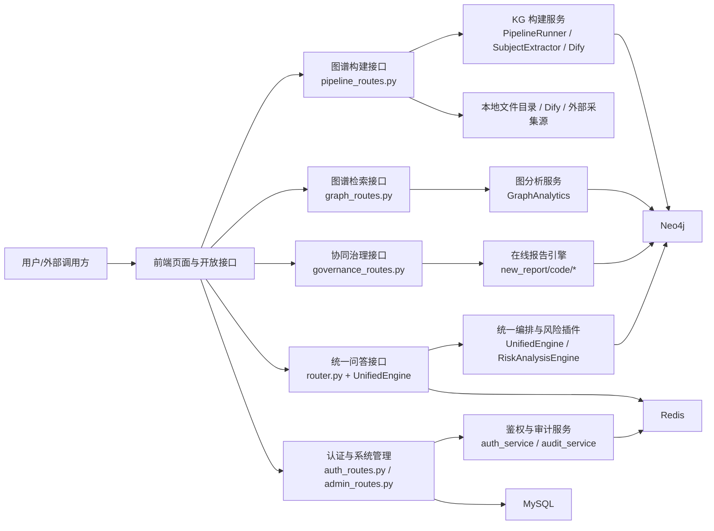
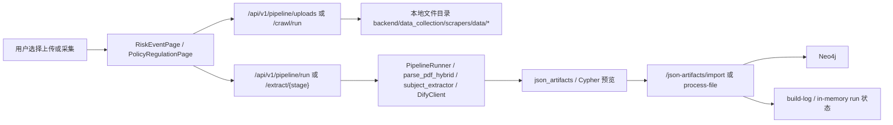
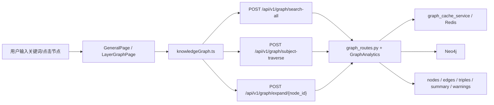
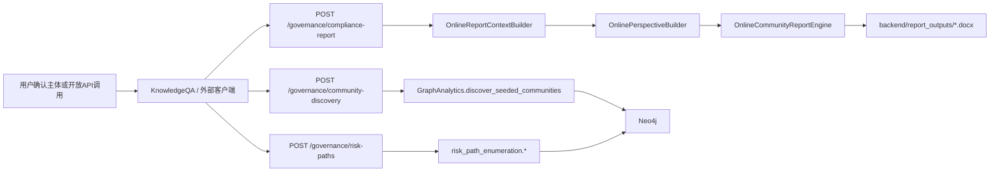
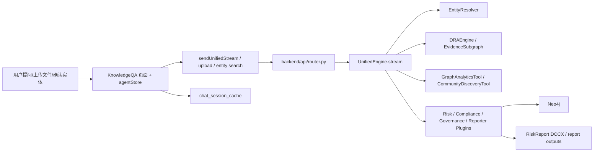
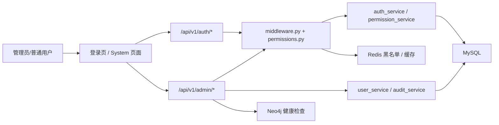

# 代码依据清单

## 图谱构建模块

| 类别 | 代码依据 |
| --- | --- |
| 前端页面 | `frontend/config/routes.ts`；`frontend/src/pages/KnowledgeBuild/RiskEventPage.tsx`；`frontend/src/pages/KnowledgeBuild/PolicyRegulationPage.tsx`；`frontend/src/pages/DataCollection/hooks/useCrawlSSE.ts`；`frontend/src/services/data-collection/index.ts` |
| 后端接口 | `backend/api/pipeline_routes.py`：`/api/v1/pipeline/crawl/run`、`/api/v1/pipeline/run`、`/api/v1/pipeline/extract/{stage}`、`/api/v1/pipeline/process-file`、`/api/v1/pipeline/uploads`、`/api/v1/pipeline/files/{source}`、`/api/v1/pipeline/json-artifacts/import`、`/api/v1/pipeline/regulations/upload` |
| 核心服务/类 | `backend/kg_construction/etl/pipeline_runner.py` `PipelineRunner.run`；`backend/kg_construction/etl/pipeline_config.py` `DATA_SOURCE_CONFIGS`；`backend/kg_construction/extraction/subject_extractor.py` `extract_and_align_subjects`、`Neo4jSubjectAligner.align`；`backend/kg_construction/fusion/entity_resolver.py` `EntityResolver.resolve`；`backend/data_collection/dify/dify_client.py`；`backend/data_collection/file_import/pdf_parser.py` |
| 数据访问/外部依赖 | Neo4j：`backend/core/database.py` `Neo4jClient`；本地文件目录：`backend/data_collection/scrapers/data/*`；Dify：`backend/config/settings.py` 中 `DIFY_*` 配置；企查查：`/api/v1/pipeline/qcc/lookup` |
| 测试代码 | 当前代码未发现针对 `backend/api/pipeline_routes.py` 的成体系接口测试；采集与下载相关测试见 `backend/tests/test_scrapers.py`、`backend/tests/test_download.py`、`backend/tests/test_risk_event_real_scrape.py` |

## 四层知识图谱检索展示模块

| 类别 | 代码依据 |
| --- | --- |
| 前端页面 | `frontend/config/routes.ts`；`frontend/src/pages/GeneralPage.tsx`；`frontend/src/pages/KnowledgeGraph/hooks/useKnowledgeGraph.ts`；`frontend/src/api/knowledgeGraph.ts`；`frontend/src/pages/KnowledgeGraph/components/LayerGraphPage.tsx`；`frontend/src/pages/CommunityDiscovery/index.tsx`；`frontend/src/pages/CommunityDiscovery/service.ts` |
| 后端接口 | `backend/api/graph_routes.py`：`/api/v1/graph/data`、`/api/v1/graph/statistics`、`/api/v1/graph/search-all`、`/api/v1/graph/subject-traverse`、`/api/v1/graph/expand/{node_id}`、`/api/v1/graph/communities`、`/api/v1/graph/communities/compare`、`/api/v1/graph/communities/{community_id}`、`/api/v1/graph/communities/{community_id}/quality` |
| 核心服务/类 | `backend/api/graph_routes.py` 中 `search_all_layers_post`、`subject_traverse_post`、`expand_node_post`；`backend/kg_query/analytics/graph_analytics.py` `GraphAnalytics.detect_communities`、`get_community_subgraph`、`discover_seeded_communities` |
| 数据访问/外部依赖 | Neo4j：`backend/core/database.py`；Redis缓存：`backend/services/graph_cache_service.py`、`backend/core/redis_client.py`；图算法：`backend/kg_query/analytics/community/*` |
| 测试代码 | `backend/tests/test_graph_search_api.py`；`backend/tests/test_graph_Nhop_api.py`；`backend/tests/test_graph_statistics.py`；`backend/tests/test_graph_data_unavailable.py`；`backend/tests/test_graph_analytics_format.py` |

## 协同治理分析模块

| 类别 | 代码依据 |
| --- | --- |
| 前端页面 | `frontend/src/pages/KnowledgeQA/store/agentStore.ts` 中在线社区报告替换逻辑；`frontend/src/pages/KnowledgeQA/components/RiskReportPanel.tsx`；`frontend/src/pages/KnowledgeQA/components/ComplianceAnalysisPanel.tsx` |
| 后端接口 | `backend/api/governance_routes.py`：`POST /api/v1/governance/community-discovery`、`POST /api/v1/governance/risk-paths`、`POST /api/v1/governance/compliance-report`、`GET /api/v1/governance/compliance-report/files/{filename}`；简化开放接口：`/api/v1/public/governance/*` |
| 核心服务/类 | `backend/api/governance_routes.py` 中 `community_discovery`、`risk_paths`、`compliance_report`；`backend/kg_query/analytics/graph_analytics.py` `discover_seeded_communities`；`backend/kg_query/analytics/risk_path_enumeration.py`；`backend/new_report/code/online_report_context_builder.py`；`backend/new_report/code/online_perspective_builder.py`；`backend/new_report/code/online_community_report_engine.py` |
| 数据访问/外部依赖 | Neo4j：`backend/core/database.py`；报告输出目录：`backend/report_outputs`；DOCX导出：`backend/dra_ma/reporting/docx_exporter.py`；实体解析前置：`backend/dra_ma/tools/entity_resolver.py` |
| 测试代码 | `backend/tests/test_governance_seed_resolution.py`；`backend/tests/test_compliance_report_new_report.py`；`backend/tests/test_public_governance_api.py`；`backend/tests/test_risk_path__api.py` |

## 智能问答模块

| 类别 | 代码依据 |
| --- | --- |
| 前端页面 | `frontend/config/routes.ts`；`frontend/src/pages/KnowledgeQA/index.tsx`；`frontend/src/pages/KnowledgeQA/store/agentStore.ts`；`frontend/src/pages/KnowledgeQA/api/agent.ts`；`frontend/src/pages/KnowledgeQA/store/chatStore.ts`；`frontend/src/pages/KnowledgeQA/components/*` |
| 后端接口 | `backend/api/router.py`：`POST /api/v1/chat/unified-stream`、`POST /api/v1/chat/recommend`、`POST /api/v1/chat/route`、`GET /api/v1/entities/search`、`POST /api/v1/entities/aliases`、`POST /api/v1/chat/upload`、`GET/POST /api/v1/chat/history*`、`GET/POST /api/v1/chat/risk-stream`、`GET /api/v1/risk/reports`、`POST /api/v1/risk/reports/export-docx`；`backend/api/chat_session_routes.py` |
| 核心服务/类 | `backend/dra_ma/orchestrator/unified_engine.py` `UnifiedEngine.stream`；`backend/dra_ma/risk_engine/risk_engine.py` `RiskAnalysisEngine.analyze_stream`；`backend/dra_ma/tools/entity_resolver.py`；`backend/services/chat_session_cache.py`；`backend/dra_ma/reporting/docx_exporter.py` |
| 数据访问/外部依赖 | Neo4j：图谱检索、`RiskReport` 节点、聊天历史；Redis：会话缓存、Token黑名单；LLM：`backend/config/settings.py` 中 `LLM_*`；上传文档解析：TXT/PDF/DOCX |
| 测试代码 | `backend/tests/test_intent_agent_fallback.py`；问答主链路接口测试当前代码未发现系统化专测；历史会话 Redis 存取通过 `backend/api/chat_session_routes.py` 与 `backend/services/chat_session_cache.py` 实现 |

## 系统管理模块

| 类别 | 代码依据 |
| --- | --- |
| 前端页面 | `frontend/config/routes.ts`；`frontend/src/pages/System/Admin/index.tsx`；`frontend/src/pages/System/Users/index.tsx`；`frontend/src/pages/System/Roles/index.tsx`；`frontend/src/pages/System/Permissions/index.tsx`；`frontend/src/pages/System/AuditLogs/index.tsx`；`frontend/src/pages/System/ApiLogs/index.tsx`；`frontend/src/services/system.ts`；登录页 `frontend/src/services/ant-design-pro/api.ts` |
| 后端接口 | `backend/api/auth_routes.py`：`/api/v1/auth/login`、`/refresh`、`/logout`、`/me`、`/permissions`；`backend/api/admin_routes.py`：用户、角色、权限、健康、仪表盘、系统配置、审计日志、API日志、开放API监控接口 |
| 核心服务/类 | `backend/api/middleware.py`；`backend/api/dependencies/permissions.py`；`backend/services/auth_service.py`；`backend/services/user_service.py`；`backend/services/permission_service.py`；`backend/services/audit_service.py`；`backend/services/dev_admin_store.py` |
| 数据访问/外部依赖 | MySQL：`backend/db/__init__.py`、`backend/db/models.py`；Redis：`backend/core/redis_client.py`；Neo4j健康检测：`backend/api/admin_routes.py` 调 `api.graph_routes._client().verify_connectivity()` |
| 测试代码 | `backend/tests/test_auth_rollout.py`；`backend/tests/test_dev_admin_store.py`；部分中间件与数据库依赖通过 `backend/tests/conftest.py` 注入 |

# 2 系统功能详细设计

## 2.1 系统总体功能架构

WindEye 当前代码实现采用“前端工作台 + FastAPI 路由层 + 领域服务/编排层 + 多存储与外部能力”的分层结构。前端以 `frontend/config/routes.ts` 为统一路由注册点，将用户入口拆分为图谱构建、四层图谱检索展示、协同治理分析、智能问答和系统管理五类页面。后端在 `backend/main.py` 启动 FastAPI 后，通过 `backend/api/router.py`、`backend/api/graph_routes.py`、`backend/api/pipeline_routes.py`、`backend/api/governance_routes.py`、`backend/api/auth_routes.py`、`backend/api/admin_routes.py` 和 `backend/api/chat_session_routes.py` 分别挂载图谱、流水线、治理、认证、审计和会话相关接口。

从数据流看，图谱构建模块负责把外部文件和本地上传内容转换为可入库的节点、关系与 Cypher；四层图谱检索展示模块负责在 Neo4j 上执行跨层搜索、主体级穿透和 N 跳扩展，并把结果回传给 G6 图可视化；协同治理分析模块以已确认主体为种子构建局部社区、风险传导路径和在线报告；智能问答模块通过统一流式编排器将意图识别、实体解析、图谱检索和风险分析串成 SSE 流；系统管理模块则以 JWT、RBAC、MySQL 审计表和 Redis 黑名单为底座，横向支撑所有业务模块。

上图对应当前代码的真实调用顺序：用户操作首先在前端页面或开放 API 中形成请求，请求被路由到对应的 FastAPI 接口，再由编排器、图分析类、抽取器或管理服务执行核心逻辑；其中图谱与报告数据主要存于 Neo4j，用户、权限、审计和系统配置由 MySQL 保存，Redis 承担会话和黑名单缓存，本地目录与 Dify 工作流承担文档解析和知识抽取。异常回退主要分三类：图谱/治理接口尽量返回 `success=false` 或警告字段维持前端可渲染；认证和权限接口返回 401/403；中间件对未知异常统一包装为 `SYS_500_INTERNAL`。

## 2.2 图谱构建模块详细设计

### 2.2.1 模块概述

图谱构建模块的前端入口位于 `frontend/src/pages/KnowledgeBuild/RiskEventPage.tsx` 与 `frontend/src/pages/KnowledgeBuild/PolicyRegulationPage.tsx`，路由分别由 `frontend/config/routes.ts` 注册到 `/knowledge-build/risk-event` 和 `/knowledge-build/policy-regulation`。模块同时支持“本地文件上传”与“脚本爬虫/数据采集”两种数据进入方式，并通过 `useCrawlSSE` 将爬取进度实时写回页面。后端核心位于 `backend/api/pipeline_routes.py`，由 `/api/v1/pipeline/crawl/run`、`/run`、`/extract/{stage}`、`/process-file`、`/json-artifacts/import` 等接口共同组织采集、解析、主体抽取、Dify 工作流调用和 Neo4j 写入。

当前实现并非单一的长事务，而是“阶段式 ETL + 中间产物落盘 + 条件入库”的组合模式。`backend/kg_construction/etl/pipeline_runner.py` 中的 `PipelineRunner` 将流水线拆为 `parse`、`extract`、`link`、`resolve`、`import`、`index` 六个阶段；图谱构建页面再通过 `/extract/{stage}` 提供独立可视化执行能力。需要特别说明的是，流水线运行状态当前主要保存在 `pipeline_routes.py` 的进程内变量 `_pipeline_runs`、`_current_run` 与 `_crawl_tasks` 中，并非独立持久化任务表，这意味着服务重启后历史状态不会自动恢复。

图中输入既可以来自上传文件也可以来自爬虫目录扫描；文本解析后进入本地主体提取或 Dify 工作流，抽取结果会先落为 JSON 工件与 Cypher 预览，再决定是否执行 Neo4j 导入。关键分支在于：一是 `subject_extraction` 目前走本地规则和 Neo4j 对齐逻辑，不依赖 Dify；二是 `event_extraction`、`feature_extraction`、`regulation_linking` 优先调用 Dify，失败时部分阶段会使用本地 fallback 结果；三是导入成功后是否清理源文件，当前代码和文档存在偏差，详见文末差异清单。

### 2.2.2 功能点一：数据采集与文件导入

**功能描述**

该功能用于把交易所风险事件 PDF、财经舆情 TXT/DOCX/PDF 以及用户手工上传文件引入图谱构建工作台。使用者既可以在风险事件页选择数据源后点击“开始采集”，也可以直接在上传区域拖拽文件。前端通过 `useCrawlSSE.startCrawl` 发起 `POST /api/v1/pipeline/crawl/run`，并对 `start`、`stage`、`file_collected`、`source_result`、`complete`、`error` 事件做实时消费；上传场景则由页面直接调用 `POST /api/v1/pipeline/uploads?source=...&clear_existing=true` 保存文件，并通过 `/api/v1/pipeline/files/{source}` 扫描目录刷新列表。

| 项目 | 内容 |
| --- | --- |
| 前置条件 | 页面已选择数据来源或已选中文件；后端 `backend/api/pipeline_routes.py` 已注册相关接口；目标目录可写。 |
| 后置结果 | 采集文件或上传文件落盘至 `backend/data_collection/scrapers/data/<source>`，前端拿到文件列表、大小、采集时间和阶段日志。 |

**核心业务逻辑**

前端入口是 `RiskEventPage.tsx` 与 `PolicyRegulationPage.tsx` 中的数据采集按钮、上传控件和已爬取文件扫描按钮。后端没有为采集接口单独定义 Pydantic 请求模型，`crawl/run` 主要接收 JSON 请求体，上传接口接收 `UploadFile`。SSE 调度逻辑在 `frontend/src/pages/DataCollection/hooks/useCrawlSSE.ts` 中实现，文件保存路径与支持的源由 `backend/kg_construction/etl/pipeline_config.py` 的 `DATA_SOURCE_CONFIGS` 决定。采集结果并不直接入库，而是先进入文件目录，再由后续 ETL 或单文件处理接口消费。

**执行步骤**

1. 用户在图谱构建页面切换到“数据采集”或“文件上传”标签，选择数据源、日期范围、文件数等参数。
2. 前端调用 `useCrawlSSE.startCrawl`，向 `POST /api/v1/pipeline/crawl/run` 发送 JSON 请求，或向 `POST /api/v1/pipeline/uploads` 发送 multipart 表单。
3. 后端根据源配置解析保存目录；采集场景将任务注册到 `_crawl_tasks` 并逐步返回 SSE 事件，上传场景直接将文件写入源目录。
4. 前端在 SSE `file_collected` 事件到达时更新当前文件、累计数量和进度，在 `complete` 事件后触发文件列表刷新。
5. 用户点击“扫描已爬取文件”或页面自动调用 `/api/v1/pipeline/files/{source}`，获取已落盘文件清单。
6. 若需要后续构建，前端再调用 `run`、`extract` 或 `process-file` 进入下一阶段。

**异常处理机制**

| 异常场景 | 判断条件 | 处理方式 | 状态或错误码 |
| --- | --- | --- | --- |
| 参数缺失 | 前端未选择来源或上传空文件 | 前端阻止提交，后端返回 400 类错误 | HTTP 400 |
| 数据源不存在 | `source` 不在 `DATA_SOURCE_CONFIGS` 中 | 后端拒绝任务 | HTTP 404 |
| 目录不存在/不可写 | 扫描目录或上传目录失败 | 返回 `success=false` 或异常消息；前端提示失败 | 运行时异常，页面展示 message |
| 爬虫过程异常 | SSE 返回 `error` 事件 | `useCrawlSSE` 写入错误状态并结束任务 | SSE `error` |
| 文件类型不支持 | 法规上传非 PDF/TXT/MD/DOCX | 后端直接拒绝 | HTTP 400 |
| 服务重启 | `_crawl_tasks` 和 `_pipeline_runs` 在内存中丢失 | 当前代码未实现任务恢复；需人工重试 | 当前代码未实现持久化恢复 |

**代码实现依据**

| 类型 | 实现位置 |
| --- | --- |
| 前端页面或组件 | `frontend/src/pages/KnowledgeBuild/RiskEventPage.tsx`；`frontend/src/pages/KnowledgeBuild/PolicyRegulationPage.tsx`；`frontend/src/pages/DataCollection/hooks/useCrawlSSE.ts` |
| API路由 | `POST /api/v1/pipeline/crawl/run`；`POST /api/v1/pipeline/uploads`；`GET /api/v1/pipeline/files/{source}` |
| 请求/响应模型 | 当前代码未为 `crawl/run`、`uploads` 定义独立 Pydantic 模型；上传采用 `UploadFile`；SSE 事件为文本流 |
| 核心服务 | `backend/api/pipeline_routes.py`；`backend/kg_construction/etl/pipeline_config.py` |
| 数据访问 | 本地文件目录 `backend/data_collection/scrapers/data/*` |
| 配置项 | `backend/kg_construction/etl/pipeline_config.py` `DATA_SOURCE_CONFIGS`；`backend/config/settings.py` `KG_DATA_DIR` |
| 测试代码 | `backend/tests/test_scrapers.py`；`backend/tests/test_download.py`；`backend/tests/test_risk_event_real_scrape.py` |

### 2.2.3 功能点二：主体提取与阶段式知识抽取

**功能描述**

该功能负责把已解析的文本转换为主体、事件、风险特征和法规节点。其中主体提取是当前代码重点实现的本地能力：`backend/kg_construction/extraction/subject_extractor.py` 会用规则、后缀词典和角色模式识别公司、银行、基金、证券、人员及监管机构，再调用 `Neo4jSubjectAligner` 与 Neo4j Subject 层做精确、别名、规范化和包含匹配。其余三个阶段通过 `POST /api/v1/pipeline/extract/{stage}` 调用 Dify 工作流，必要时使用 fallback 结果保证页面不空白。

| 项目 | 内容 |
| --- | --- |
| 前置条件 | 已存在解析后的文本记录，或源目录可被重新扫描；Dify Key 已在 `.env` 中配置对应阶段密钥。 |
| 后置结果 | 返回节点、关系、统计卡片、Cypher 预览和 JSON 工件路径；主体阶段额外返回对齐状态、角色、证据文本和匹配方式。 |

**核心业务逻辑**

页面主体提取区会调用 `/api/v1/pipeline/extract/subject_extraction?source=...`，后端在 `extract_stage` 中检测到 `stage == "subject_extraction"` 后，转入 `extract_and_align_subjects`。该函数先按文件列表构造 `texts`，再由 `extract_subject_candidates` 执行后缀词典与角色正则抽取，最后由 `Neo4jSubjectAligner.align` 查询 Neo4j 做 `EXACT_MATCH`、`ALIAS_MATCH`、`FUZZY_MATCH`、`LOW_CONFIDENCE` 或 `NEW_ENTITY` 判定。事件、特征和法规阶段则由 `DifyClient.run_workflow_for_stage` 执行；`feature_extraction` 依赖先前事件工件，法规阶段会先调用 `chunk_regulation_text` 切块。

**执行步骤**

1. 用户在图谱构建页面点击“主体提取”或后续阶段按钮，前端向 `POST /api/v1/pipeline/extract/{stage}` 发送来源参数。
2. 后端优先从最近一次 `_pipeline_runs` 中读取文本，若不存在则直接扫描源目录并解析文件。
3. 当阶段为 `subject_extraction` 时，系统调用 `extract_and_align_subjects`，在内存中完成候选抽取、去重、角色识别和 Neo4j 对齐。
4. 当阶段为 `event_extraction`、`feature_extraction` 或 `regulation_linking` 时，系统调用 `DifyClient`；若无结果且阶段允许 fallback，则生成本地回退结果。
5. 系统使用 `_write_kg_json_artifact` 落盘 JSON 工件，并调用 `generate_cypher_from_dify_jsonl` 生成 Cypher 预览与数量统计。
6. 前端据返回值刷新统计卡片、表格、关系数量和阶段日志。

**异常处理机制**

| 异常场景 | 判断条件 | 处理方式 | 状态或错误码 |
| --- | --- | --- | --- |
| 阶段非法 | `stage` 不在 `_VALID_EXTRACT_STAGES` 中 | 拒绝请求 | HTTP 400 |
| 数据源非法 | `source` 未配置 | 拒绝请求 | HTTP 404 |
| 无文本数据 | 没有最新解析结果且源目录为空 | 返回空节点和提示消息 | `success=true`，message 提示先执行数据导入 |
| 特征抽取缺少事件工件 | 未找到 `event_extraction` JSON 工件 | 返回业务失败结果 | `success=false`，提示先运行事件抽取 |
| Dify 调用失败 | 工作流异常或返回空 | 记录 `dify_error`，部分阶段走 fallback | `success=true` + `fallback=true` 或错误信息 |
| Neo4j 对齐不可用 | `Neo4jClient.from_env()` 失败 | 主体统一标记为 `NEW_ENTITY` | 业务降级，无 HTTP 异常 |

**代码实现依据**

| 类型 | 实现位置 |
| --- | --- |
| 前端页面或组件 | `frontend/src/pages/KnowledgeBuild/RiskEventPage.tsx`；`frontend/src/pages/KnowledgeBuild/PolicyRegulationPage.tsx` |
| API路由 | `POST /api/v1/pipeline/extract/{stage}` |
| 请求/响应模型 | 当前代码未定义独立 Pydantic 请求模型；返回体为字典，包含 `nodes`、`edges`、`stats`、`json_artifact`、`cypher_preview` 等字段 |
| 核心服务 | `backend/api/pipeline_routes.py` `extract_stage`；`backend/kg_construction/extraction/subject_extractor.py`；`backend/data_collection/dify/dify_client.py` |
| 数据访问 | Neo4j 对齐查询：`Neo4jSubjectAligner`；本地文件解析：`parse_pdf_hybrid`、DOCX/TXT 读取 |
| 配置项 | `backend/config/settings.py` 中 `DIFY_SUBJECT_API_KEY`、`DIFY_EVENT_API_KEY`、`DIFY_FEATURE_API_KEY`、`DIFY_REGULATION_API_KEY` |
| 测试代码 | 主体提取当前代码未发现单元测试；治理种子解析与实体对齐思路可参考 `backend/tests/test_governance_seed_resolution.py` |

### 2.2.4 功能点三：Neo4j 导入、单文件处理与构建状态管理

**功能描述**

该功能负责把阶段产出的实体、关系或 Dify 结果转换为可执行 Cypher，并在明确条件满足时写入 Neo4j。页面上既可以通过完整流水线调用 `POST /api/v1/pipeline/run`，也可以对单个文件调用 `POST /api/v1/pipeline/process-file`。构建成功后，前端通过 `/api/v1/pipeline/status`、`/api/v1/pipeline/build-log`、`/api/v1/pipeline/json-artifacts` 查看运行状态、历史日志和中间工件。

| 项目 | 内容 |
| --- | --- |
| 前置条件 | 已有解析或抽取结果；Neo4j 连接可用；必要时用户显式确认允许导入。 |
| 后置结果 | 节点和关系写入 Neo4j，构建日志被追加，前端展示导入统计；部分接口会删除源文件。 |

**核心业务逻辑**

完整流水线通过 `trigger_pipeline_run` 创建 `PipelineRunner`，按阶段注册 `parse`、`extract/import`、`link`、`resolve`、`index` 处理器，并将执行结果序列化到 `_pipeline_runs`。当 `end_stage` 进入 `import` 或 `index` 时，代码要求 `confirmed_import=true`，否则返回 400。与之不同，`process_single_file` 走的是快速单文件通道：解析文件、顺序调用多个 Dify 阶段、去重、生成 JSONL 与 Cypher，再立即执行 `Neo4jClient.execute_read`；若 `import_errors == 0`，代码会直接 `os.remove(filePath)` 删除原文件。

**执行步骤**

1. 用户点击“开始构建”或“执行 ETL 流水线”，前端调用 `POST /api/v1/pipeline/run`，或在文件级按钮中调用 `POST /api/v1/pipeline/process-file`。
2. 后端校验数据源和导入确认参数；若目标阶段是 `import/index` 且未确认，则直接拒绝。
3. `PipelineRunner.run` 依次执行各阶段处理器，并把 `_records`、`_entities` 等中间状态在各阶段间传递。
4. 导入阶段使用 `generate_cypher_from_dify_jsonl` 或 `batch_generate_cypher` 生成 Cypher，再通过 `Neo4jClient` 执行。
5. 系统更新 `_pipeline_runs`、`_current_run`、构建日志和 JSON 工件索引；前端通过 `status`、`build-log`、`json-artifacts` 刷新界面。
6. 若为单文件处理且没有导入错误，接口会删除源文件；否则保留文件并返回错误计数。

**异常处理机制**

| 异常场景 | 判断条件 | 处理方式 | 状态或错误码 |
| --- | --- | --- | --- |
| 导入未确认 | `end_stage in {import,index}` 且 `confirmed_import=false` | 拒绝执行 | HTTP 400 |
| 源文件不存在 | `process-file` 的 `filePath` 无效 | 拒绝执行 | HTTP 404 |
| 数据源不存在 | `source` 未配置 | 拒绝执行 | HTTP 404 |
| Neo4j 执行失败 | Cypher 执行异常 | 返回错误数或抛 500 | `success=false` / HTTP 500 |
| 阶段处理器未注册 | `PipelineRunner` 找不到处理器 | 该阶段标记 `skipped` 或执行失败 | 内存状态 `skipped/failed` |
| 部分成功 | 仅部分 Cypher 成功执行 | 返回 `executed` 与 `errors` 计数；前端需按部分成功处理 | 部分成功，无统一业务码 |

**代码实现依据**

| 类型 | 实现位置 |
| --- | --- |
| 前端页面或组件 | `frontend/src/pages/KnowledgeBuild/RiskEventPage.tsx`；`frontend/src/pages/KnowledgeBuild/PolicyRegulationPage.tsx` |
| API路由 | `POST /api/v1/pipeline/run`；`POST /api/v1/pipeline/process-file`；`GET /api/v1/pipeline/status`；`GET/POST /api/v1/pipeline/build-log`；`GET /api/v1/pipeline/json-artifacts`；`POST /api/v1/pipeline/json-artifacts/import` |
| 请求/响应模型 | 当前代码以 Query 参数和字典返回为主，未单独定义 Pydantic 模型 |
| 核心服务 | `backend/api/pipeline_routes.py`；`backend/kg_construction/etl/pipeline_runner.py`；`backend/kg_construction/etl/cypher_generator.py` |
| 数据访问 | Neo4j：`backend/core/database.py` `Neo4jClient`；文件工件：`KG_OUTPUT_DIR` |
| 配置项 | `ETL_BATCH_SIZE`、`ETL_MAX_RETRIES`、`NEO4J_*` |
| 测试代码 | 当前代码未发现针对导入链路的自动化测试 |

### 2.2.5 模块异常与状态管理

图谱构建模块的状态管理分为前端阶段状态和后端运行状态两层。前端依靠页面内部 state 与 `useCrawlSSE` 保存当前阶段、构建卡片统计和最近日志；后端则把流水线过程状态保存在 `_pipeline_runs`、`_current_run` 与 `_crawl_tasks`。这种实现对单实例开发环境足够直接，但不具备多实例共享、进程重启恢复和长期审计能力。对于 HTTP 类接口，当前模块以 FastAPI 的 400/404/500 为主；对于阶段执行类接口，更常见的做法是返回 `success=true/false` 和 `message`/`warning` 字段，让前端继续显示中间结果。

需要单独指出两点。其一，主体提取阶段已经具备“抽取 + 对齐 + 匹配状态”的真实实现，而事件、特征和法规阶段仍高度依赖 Dify 与 fallback；因此页面展示的“阶段成功”不必然等于完整知识图谱已经稳定入库。其二，源码中 `trigger_pipeline_run` 对完整导入链路增加了 `confirmed_import` 保护，但 `process_single_file` 在 `import_errors == 0` 时直接删除源文件，和“仅在确认导入成功后清理缓存文件”的业务要求并不完全一致，后续应统一到同一文件生命周期策略。

## 2.3 四层知识图谱检索展示模块详细设计

### 2.3.1 模块概述

四层知识图谱检索展示模块的主入口是 `/knowledge-graph`，对应 `frontend/src/pages/GeneralPage.tsx`；分层入口则由 `SubjectPage.tsx`、`EventPage.tsx`、`FeaturePage.tsx` 和 `RegulationPage.tsx` 复用 `LayerGraphPage.tsx` 实现。模块的统一 API 封装位于 `frontend/src/api/knowledgeGraph.ts`，核心调用包括 `searchAllGraph`、`subjectTraverseGraph` 和 `expandGraphNode`。后端则由 `backend/api/graph_routes.py` 提供图数据拉取、跨层搜索、主体穿透、N 跳展开、统计和社区发现相关接口。

模块的设计重点不在“全量展示所有图”，而在于围绕命中节点构造一个可控、可裁剪、可解释的局部子图。`search_all_layers_post` 首先检索中心节点，再根据 `traversalMode` 决定使用主体级级联搜索还是通用 BFS；`expand_node_post` 在返回节点闭包后补齐内部关系，避免前端出现“节点已出现但边不完整”的视觉断裂；Redis 缓存仅作为性能增强，不影响主流程正确性。

输入来自页面搜索栏、分层筛选器或图节点点击；主要组件包括前端 hook、API 封装、后端图路由和 `GraphAnalytics`。关键判断分支体现在层级过滤、关系白名单、级联模式与超级节点裁剪。结果不会持久回写数据库，而是以局部子图、统计摘要、三元组和告警的形式返回前端；异常时若 Neo4j 不可用，接口要么返回 `success=false`，要么触发全局 `RET_503_GRAPH_UNAVAILABLE`/`SYS_500_INTERNAL` 风格的错误响应。

### 2.3.2 功能点一：跨层关键词搜索与结果汇总

**功能描述**

该功能用于在 Subject、Event、Feature、Regulation 四层之间执行统一关键词搜索。用户在 `/knowledge-graph` 页面输入关键字后，`useKnowledgeGraph.search` 会调用 `POST /api/v1/graph/search-all`，请求中可包含层级、深度、类型、关系白名单、输出格式、是否跨层和响应模式等参数。后端在 `search_all_layers_post` 中先命中中心节点，再扩展出局部子图，最终返回 `matchedNodes`、`nodes`、`edges`、`triples`、`summary`、`warnings` 和 `traceId`。

| 项目 | 内容 |
| --- | --- |
| 前置条件 | Neo4j 可用；页面已初始化或用户已输入关键词。 |
| 后置结果 | 前端图视图、摘要栏和告警区展示与关键词相关的跨层子图和统计信息。 |

**核心业务逻辑**

前端入口是 `GeneralPage.tsx` 中的搜索控件，API 封装在 `frontend/src/api/knowledgeGraph.ts` 的 `searchAllGraph`。请求模型为 `backend/api/graph_routes.py` 中的 `SearchAllRequest`，响应模型为 `SearchAllResponse`。核心服务函数是 `search_all_layers_post`：它先根据关键词和层级寻找中心节点；如果是主体级关键词且 `traversalMode == "cascade"`，则转入 `_search_subject_cascade` 执行四层定向展开，否则调用 `expand_subgraph` 做 BFS；最后把结果整理成 `subgraph` 与 `triples` 两种表示并尝试写入 Redis 摘要缓存。

**执行步骤**

1. 用户在总览页输入关键词并设置搜索层、深度或类型。
2. 前端调用 `searchAllGraph`，将默认参数与用户参数合并后提交到 `POST /api/v1/graph/search-all`。
3. 后端用 `SearchAllRequest` 完成参数校验，生成 `trace_id`，解析全局 limit 与白名单。
4. 系统先在候选层中检索中心节点；若没有命中，则返回空子图和 `NO_MATCHED_NODE` 警告。
5. 若命中主体中心且满足级联模式，系统按 Subject→Event/Feature/Regulation 的方向级联扩展；否则执行统一 BFS。
6. 系统整理节点、边、三元组、关系类型统计和层分布摘要，并写入 Redis 子图摘要缓存。
7. 前端接收结果并更新画布、命中节点高亮和统计条。

**异常处理机制**

| 异常场景 | 判断条件 | 处理方式 | 状态或错误码 |
| --- | --- | --- | --- |
| 请求为空 | `query` 缺失或为空 | Pydantic 拒绝请求 | HTTP 422 |
| 层级/输出格式非法 | 枚举值不合法 | Pydantic 拒绝请求 | HTTP 422 |
| 未命中节点 | 中心节点集合为空 | 返回空结果并附告警 | `success=true` + `warnings=[NO_MATCHED_NODE]` |
| Neo4j 查询异常 | 图查询抛错 | 捕获并返回失败响应 | `success=false`，`errorCode`/message |
| Redis 不可用 | 缓存写入失败 | 忽略缓存，不中断主流程 | 降级，无错误码暴露 |

**代码实现依据**

| 类型 | 实现位置 |
| --- | --- |
| 前端页面或组件 | `frontend/src/pages/GeneralPage.tsx`；`frontend/src/pages/KnowledgeGraph/hooks/useKnowledgeGraph.ts` |
| API路由 | `POST /api/v1/graph/search-all`；兼容 `GET /api/v1/graph/search-all` |
| 请求/响应模型 | `SearchAllRequest`；`SearchAllResponse`；`SearchAllSummary` |
| 核心服务 | `backend/api/graph_routes.py` `search_all_layers_post` |
| 数据访问 | Neo4j；Redis 摘要缓存 `backend/services/graph_cache_service.py` |
| 配置项 | 图限额由 `graph_routes.py` 内部 `_resolve_graph_limits()` 解析；当前未抽成单独配置文件 |
| 测试代码 | `backend/tests/test_graph_search_api.py`；`backend/tests/test_search_all_api.py` |

### 2.3.3 功能点二：主体穿透遍历与 N 跳展开

**功能描述**

该功能面向已经确认的节点或主体，在已有图上做进一步穿透。对于面向主体的业务问题，前端会调用 `subjectTraverseGraph`，由后端 `subject_traverse_post` 启动更强约束的主体级遍历；对于任意节点点击展开，则调用 `expandGraphNode` 进入 `expand_node_post`。两个接口的目标都是在限制节点数、边数和超级节点扇出数量的前提下，尽量保持局部关系闭包完整，满足前端逐步钻取和图上交互需要。

| 项目 | 内容 |
| --- | --- |
| 前置条件 | 用户已选中节点，或已输入主体名称/`startNodeId`。 |
| 后置结果 | 返回一个追加型局部子图，前端在原图上增量合并节点和关系。 |

**核心业务逻辑**

`frontend/src/api/knowledgeGraph.ts` 为两个接口设置了默认深度、节点上限和层白名单。后端请求模型分别为 `SubjectTraverseRequest` 和 `ExpandRequest`。`expand_node_post` 会先用 `elementId(n)` 验证中心节点是否存在，然后在主体层尝试复用级联搜索，否则执行 BFS；完成节点发现后，再调用闭包查询补齐节点集内部关系。`subject_traverse_post` 则要求至少提供主体名称或 `startNodeId`，从入口上约束“只针对主体问题”。

**执行步骤**

1. 用户在图中点击节点，或在页面触发主体穿透查询。
2. 前端调用 `expandGraphNode` 或 `subjectTraverseGraph`，提交深度、限制数和白名单。
3. 后端用 `ExpandRequest`/`SubjectTraverseRequest` 校验参数，并获取中心节点。
4. 如果中心节点位于 Subject 层且支持级联模式，则优先走方向性级联展开；否则执行统一 BFS。
5. 系统根据节点集合回查闭包关系，生成完整 `nodes`、`edges`、`triples` 和摘要。
6. 前端将新增图元合并进当前图状态，并刷新统计、聚焦或 dim 非关联节点。

**异常处理机制**

| 异常场景 | 判断条件 | 处理方式 | 状态或错误码 |
| --- | --- | --- | --- |
| 中心节点不存在 | `elementId` 查无此节点 | 返回失败 | `success=false`，`errorCode=NODE_NOT_FOUND` |
| 主体遍历缺少入口 | 未提供 `keyword` 与 `startNodeId` | 返回失败 | `success=false`，`EMPTY_SUBJECT` |
| 结果被裁剪 | 节点或边超出上限 | 返回告警，前端仍渲染截断结果 | `warnings` 中包含截断信息 |
| 级联失败 | 级联过程异常 | 回退到 BFS，并附降级告警 | `warnings=[CASCADE_FALLBACK_TO_BFS]` |
| Neo4j 不可用 | 图查询失败 | 返回 503 或统一错误 | `RET_503_GRAPH_UNAVAILABLE` / `INTERNAL_ERROR` |

**代码实现依据**

| 类型 | 实现位置 |
| --- | --- |
| 前端页面或组件 | `frontend/src/pages/KnowledgeGraph/hooks/useKnowledgeGraph.ts`；`frontend/src/pages/KnowledgeQA/components/EnhancedGraphPanel.tsx` |
| API路由 | `POST /api/v1/graph/subject-traverse`；`POST /api/v1/graph/expand/{node_id}`；兼容 `GET /api/v1/graph/expand/{node_id}` |
| 请求/响应模型 | `SubjectTraverseRequest`；`ExpandRequest`；复用 `SearchAllResponse` |
| 核心服务 | `backend/api/graph_routes.py` `subject_traverse_post`、`expand_node_post` |
| 数据访问 | Neo4j；节点度与 hub 判断缓存由 `graph_cache_service` 辅助 |
| 配置项 | 扇出、深度、节点边限制由请求参数与内部限额函数共同控制 |
| 测试代码 | `backend/tests/test_graph_Nhop_api.py` |

### 2.3.4 功能点三：分层浏览、统计与社区发现可视化

**功能描述**

模块除了统一总览页外，还提供按层浏览和图社区可视化能力。`LayerGraphPage.tsx` 用于 Subject/Event/Feature/Regulation 单层浏览，支持 `GET /api/v1/graph/data`、`GET /api/v1/graph/statistics`、`GET /api/v1/graph/subgraph/{node_id}` 等接口。`CommunityDiscovery/index.tsx` 则通过 `/api/v1/graph/communities`、`/compare` 和 `/communities/{community_id}` 把不同社区算法的结果以全图与右侧详情面板形式展示出来。

| 项目 | 内容 |
| --- | --- |
| 前置条件 | 图数据库已存在对应层数据；页面已选择算法或层过滤条件。 |
| 后置结果 | 用户可浏览单层图、对比算法、查看社区详情及导出 PNG/CSV。 |

**核心业务逻辑**

单层浏览由前端直接请求图数据与统计数据，社区发现则调用 `frontend/src/pages/CommunityDiscovery/service.ts` 中的 `discoverCommunities`、`compareAlgorithms` 和 `getCommunityGraph`。后端真正执行算法的是 `GraphAnalytics.detect_communities`、`compare_algorithms` 和 `get_community_subgraph`。代码层面支持 WCC、Louvain、Leiden、Label Propagation、Spectral、Infomap 以及带 fallback 的 `hgt_gkmeans`；但 `hgt_gkmeans` 使用的是已有图向量，不会在请求时重新训练 HGT。

**执行步骤**

1. 用户打开单层页面或群体发现页面。
2. 单层页面请求 `graph/data` 与 `graph/statistics` 初始化画布；社区发现页提交算法、最小社区规模和最大节点数。
3. 后端基于层标签与算法名称调用 `GraphAnalytics.detect_communities` 或 `compare_algorithms`。
4. 若用户点击某个社区，前端调用 `getCommunityGraph` 拉取社区子图，并将其与全图视图联动。
5. 页面允许导出 CSV 和 PNG，导出逻辑完全在前端完成，不写回后端。

**异常处理机制**

| 异常场景 | 判断条件 | 处理方式 | 状态或错误码 |
| --- | --- | --- | --- |
| 算法未知 | 注册表找不到算法 | 返回失败结果 | `success=false`，`error=Unknown method` |
| 算法运行异常 | 算法内部抛错 | 捕获异常并给出失败说明 | `success=false`，`error=Algorithm failed` |
| 社区编号越界 | `community_id` 超过社区列表长度 | 返回空图 | `{nodes:[], edges:[]}` |
| 图谱加载失败 | 前端 fetch 失败 | 页面提示“服务连接失败/加载子图失败” | 前端 message 错误 |

**代码实现依据**

| 类型 | 实现位置 |
| --- | --- |
| 前端页面或组件 | `frontend/src/pages/KnowledgeGraph/components/LayerGraphPage.tsx`；`frontend/src/pages/CommunityDiscovery/index.tsx`；`frontend/src/pages/CommunityDiscovery/service.ts` |
| API路由 | `GET /api/v1/graph/data`；`GET /api/v1/graph/statistics`；`GET /api/v1/graph/communities`；`GET /api/v1/graph/communities/compare`；`GET /api/v1/graph/communities/{community_id}` |
| 请求/响应模型 | 单层 GET 接口未定义独立 Pydantic 模型；社区详情和比较结果为字典结构 |
| 核心服务 | `backend/kg_query/analytics/graph_analytics.py`；`backend/kg_query/analytics/community/*` |
| 数据访问 | Neo4j |
| 配置项 | 算法元信息由社区算法注册表提供 |
| 测试代码 | `backend/tests/test_graph_statistics.py`；社区格式测试见 `backend/tests/test_graph_analytics_format.py` |

### 2.3.5 模块异常与状态管理

该模块的状态主要由前端 hook 管理，后端不保留用户级浏览会话。`useKnowledgeGraph` 维护 `nodes`、`edges`、`matchedNodes`、`triples`、`summary`、`warnings` 和 `traceId`，任何一次搜索或展开都会在当前浏览态上叠加或替换结果。相比图谱构建模块，这里的错误处理更偏向“返回可显示的失败信息而不是中断页面”，因此很多接口即便没有命中也会返回 `success=true` 和空数组，辅以 warning 字段提示用户问题。

当前实现已经具备较完整的搜索与展开自动化测试，但页面层仍存在新旧接口并存的情况：例如总览页优先使用 `POST /api/v1/graph/search-all`，而 `LayerGraphPage.tsx` 仍保留部分基于 GET 的兼容调用。这类兼容路径在维护时需要额外关注，避免前后端行为分叉。

## 2.4 协同治理分析模块详细设计

### 2.4.1 模块概述

协同治理分析模块的后端主实现位于 `backend/api/governance_routes.py`，向内调用 `GraphAnalytics`、`risk_path_enumeration` 和 `backend/new_report/code/*` 在线报告引擎；向外暴露三条主链路接口：`POST /api/v1/governance/community-discovery`、`POST /api/v1/governance/risk-paths`、`POST /api/v1/governance/compliance-report`。此外，代码中还提供面向开放调用的精简版本 `/api/v1/public/governance/*`，用于压缩入参和响应体。前端消费点目前主要在 `KnowledgeQA` 页面：`agentStore.ts` 在收到统一问答的基础报告后，会再次调用 `generateComplianceCommunityReport` 以在线社区报告替换旧风险报告展示。

模块的真实执行路径并不是简单调用一个 LLM，而是先完成实体解析、种子确认、局部社区构建、路径枚举和上下文归一化，再由 `OnlineCommunityReportEngine` 输出结构化报告和 DOCX 文件。报告输出目录由 `governance_routes.py` 常量 `REPORT_OUTPUT_DIR` 指向 `backend/report_outputs`，下载接口通过 `GET /api/v1/governance/compliance-report/files/{filename}` 暴露。

输入来自已确认主体名、主体 ID 或前置社区/路径结果；主要组件包括治理路由、实体解析器、图分析类、风险路径枚举器和 `new_report` 在线报告引擎。关键分支在于：是否需要先补做种子解析、是否复用已给定的社区与路径结果、是否生成 DOCX。最终结果一部分返回给前端，一部分以 DOCX 或下载 URL 的形式落在 `backend/report_outputs`；异常时优先返回结构化错误与 `entityResolution`、`pipelineTrace` 等上下文，避免前端只能看到空白失败。

### 2.4.2 功能点一：风险主体群体发现

**功能描述**

该功能用于从一个或多个已确认主体出发，抽取局部 k-hop 网络并在其中发现风险社区。请求模型为 `CommunityDiscoveryRequest`，允许同时提交 `seedNames`、`seedIds`、自动选种子参数、风险关系约束、算法方法、最小社区规模、路径上限和最大节点数。接口除了返回社区列表外，还会返回 `seedNodes`、`subgraph`、`seedCommunityId`、`entityCommunityMap` 和 `communityGraph`，为后续风险路径与报告生成奠定基础。

| 项目 | 内容 |
| --- | --- |
| 前置条件 | 已提供主体名或主体 ID；Neo4j 中存在相关种子节点。 |
| 后置结果 | 获得一个局部子图及其社区划分、核心成员、桥接成员和社区图。 |

**核心业务逻辑**

后端入口是 `governance_routes.py` 中的 `community_discovery`。在真正进入 `GraphAnalytics.discover_seeded_communities` 前，系统会调用 `_resolve_seed_entities` 尝试把输入名解析为真实 `seedIds`，并把解析结果塞入响应中的 `entityResolution`。社区发现本身不重新训练 GNN，而是调用 `graph_analytics.py` 在 Neo4j 子图上进行 `ego network` 抽取、连通分量筛选、局部社区算法选择和实体到社区映射。返回结果会通过 `_build_response` 统一补入耗时、trace 信息和种子解析信息。

**执行步骤**

1. 用户或上层模块提交 `seedNames`/`seedIds` 和社区发现参数。
2. 路由调用 `_resolve_seed_entities`，优先把模糊主体名转成真实 `kgNodeId`。
3. 系统实例化 `GraphAnalytics` 并执行 `discover_seeded_communities`。
4. `GraphAnalytics` 先解析种子节点，再抽取 k-hop 子图，保留最大连通分量并按限制数裁剪。
5. 系统根据算法参数选择 Louvain、WCC、Leiden、Infomap 或 `hgt_gkmeans` 等局部算法，输出社区划分。
6. 后端构造 `seedCommunityId`、`entityCommunityMap`、`communityGraph` 和 summary，返回给调用方。

**异常处理机制**

| 异常场景 | 判断条件 | 处理方式 | 状态或错误码 |
| --- | --- | --- | --- |
| 未提供种子 | `seedNames` 和 `seedIds` 同时为空 | 返回失败 | `success=false`，错误信息提示缺少 seed |
| 种子未匹配 | 解析后没有 `resolvedSeedIds` | 返回失败并附实体解析结果 | `success=false`，`entityResolution` |
| Neo4j 客户端未配置 | `GraphAnalytics` 无 `_db` | 返回失败 | `success=false`，`error=Neo4j client is not configured` |
| 局部子图为空 | 未抽取到连通网络 | 返回失败 | `success=false`，`error=No connected subgraph found` |
| 算法回退 | 指定算法不可用或失败 | 返回 `selected_method` 与 `fallback_reason` | 业务成功但带回退信息 |

**代码实现依据**

| 类型 | 实现位置 |
| --- | --- |
| 前端页面或组件 | `frontend/src/pages/KnowledgeQA/store/agentStore.ts`（报告替换前置） |
| API路由 | `POST /api/v1/governance/community-discovery`；`POST /api/v1/public/governance/community-discovery` |
| 请求/响应模型 | `CommunityDiscoveryRequest`；`PublicCommunityDiscoveryRequest` |
| 核心服务 | `backend/api/governance_routes.py` `community_discovery`；`backend/kg_query/analytics/graph_analytics.py` `discover_seeded_communities` |
| 数据访问 | Neo4j |
| 配置项 | 社区算法由 `backend/kg_query/analytics/community/*` 注册；响应模式与深度由请求参数控制 |
| 测试代码 | `backend/tests/test_governance_seed_resolution.py`；`backend/tests/test_public_governance_api.py` |

### 2.4.3 功能点二：风险传导路径分析

**功能描述**

该功能在局部社区或种子主体周边网络中识别风险传导路径，并把结果压缩为可解释路径、社区级路径和前端高亮模型。请求模型 `RiskPathsRequest` 支持 `maxHop`、`maxPathLength`、`riskRelationWhitelist`、`riskPathLimit`、`maxBranchPerNode` 和 `minRiskScore` 等参数，目标是避免路径爆炸，同时为每条路径给出评分和传播链说明。接口返回 `riskPaths`、`communityRiskPaths`、`viewModel`、`summary` 和 `entityResolution`。

| 项目 | 内容 |
| --- | --- |
| 前置条件 | 已有真实种子主体；Neo4j 中存在足够的关系网络。 |
| 后置结果 | 返回受限多跳风险路径、社区传播路径和前端高亮信息。 |

**核心业务逻辑**

路由 `risk_paths` 先复用 `_resolve_seed_entities`，再调用 `GraphAnalytics.discover_seeded_communities` 获得局部子图。真正的路径计算使用 `kg_query.analytics.risk_path_enumeration`：先执行 `enumerate_multi_hop_risk_paths` 枚举候选路径，再调用 `score_risk_paths` 赋分，之后利用 `build_community_risk_paths` 和 `build_view_model` 组织社区级路径与前端视图模型。与旧版问答链路不同，这里已经不依赖 `RiskAnalysisEngine` 生成 markdown，而是直接走治理专用计算链。

**执行步骤**

1. 调用方提交主体名/ID与路径分析约束。
2. 路由完成主体解析，失败时直接返回 `entityResolution` 并终止。
3. 系统调用 `discover_seeded_communities` 抽取局部子图和社区结构。
4. 在该子图上执行 `enumerate_multi_hop_risk_paths`，限制跳数、路径长度和分支。
5. 使用 `score_risk_paths` 对候选路径打分，并按阈值和数量上限筛选。
6. 系统构造社区级传播链和 `viewModel`，把结果返回给前端。

**异常处理机制**

| 异常场景 | 判断条件 | 处理方式 | 状态或错误码 |
| --- | --- | --- | --- |
| 种子解析失败 | 没有解析出有效 ID | 返回失败并保留 `entityResolution` | `success=false` |
| 子图无法构建 | 社区发现阶段失败 | 返回失败 | `success=false` |
| 路径为空 | 网络中未找到满足条件的路径 | 返回空列表与摘要 | 业务成功，列表为空 |
| 未知异常 | 枚举或评分异常 | 捕获并记录日志 | `success=false` 或 HTTP 500 |

**代码实现依据**

| 类型 | 实现位置 |
| --- | --- |
| 前端页面或组件 | `frontend/src/pages/KnowledgeQA/store/agentStore.ts`；`frontend/src/pages/KnowledgeQA/components/ComplianceAnalysisPanel.tsx` |
| API路由 | `POST /api/v1/governance/risk-paths`；`POST /api/v1/public/governance/risk-paths` |
| 请求/响应模型 | `RiskPathsRequest`；`PublicRiskPathsRequest` |
| 核心服务 | `backend/api/governance_routes.py` `risk_paths`；`backend/kg_query/analytics/risk_path_enumeration.py` |
| 数据访问 | Neo4j |
| 配置项 | 路径长度、分支数、阈值由请求参数控制 |
| 测试代码 | `backend/tests/test_risk_path__api.py`；`backend/tests/test_public_governance_api.py` |

### 2.4.4 功能点三：协同治理社区报告生成与导出

**功能描述**

该功能以“已确认主体”为唯一必要输入，自动串联社区发现、风险路径、上下文归一化、视角构建和报告生成，并可输出 DOCX 文件。请求模型为 `ComplianceReportRequest`，既允许只提交 `query`、`seedNames`/`seedIds`，也允许调用方把前置子图、社区结果、风险路径和异常发现一并传入，以跳过重复计算。响应中包含 `complianceIndicators`、`governance`、`report`、`viewModel`、`pipelineTrace`、`entityResolution` 以及 `exportFiles`。

| 项目 | 内容 |
| --- | --- |
| 前置条件 | 已有可解析的主体；导出目录可写；若需要 DOCX，`DocxExporter` 相关依赖可用。 |
| 后置结果 | 生成结构化社区报告，并在需要时把 DOCX 文件保存到 `backend/report_outputs`。 |

**核心业务逻辑**

`compliance_report` 首先做种子解析，然后检查请求里是否已经带了 `communityDiscovery` 与 `riskPaths`；若没有，则内部顺序调用 `community_discovery` 与 `risk_paths` 进行补齐。随后 `_build_compliance_report` 调用 `OnlineReportContextBuilder.build` 归一化上下文，再调用 `OnlinePerspectiveBuilder.build` 生成责任方/违规/监管三视角包，最后由 `OnlineCommunityReportEngine.generate` 输出结构化报告。若 `exportFormats` 包含 `docx`，系统通过 `_export_compliance_report_docx` 和 `_apply_export_delivery_options` 生成文件元信息与下载地址。

**执行步骤**

1. 调用方提交主体及报告参数，或附带前置结果。
2. 路由解析种子主体，并把解析结果记录到 `pipelineTrace` 和 `entityResolution`。
3. 若请求未带社区发现结果，则内部调用 `community_discovery`；若未带路径结果，则继续调用 `risk_paths`。
4. 系统把种子节点、子图、社区、路径和异常发现交给 `OnlineReportContextBuilder`。
5. `OnlinePerspectiveBuilder` 基于责任方、违规、监管三视角构建摘要、关键节点和跨视角连接。
6. `OnlineCommunityReportEngine.generate` 生成报告结构、治理动作、指标卡片和前端高亮视图。
7. 若请求包含导出格式，系统调用 DOCX 导出器，保存文件并返回下载信息。

**异常处理机制**

| 异常场景 | 判断条件 | 处理方式 | 状态或错误码 |
| --- | --- | --- | --- |
| 主体无法解析 | 无种子节点且别名解析失败 | 返回失败并附实体解析信息 | `success=false` |
| 前置结果缺失 | 请求未传社区/路径，内部补算又失败 | 返回失败或部分结果 | `success=false` / 部分成功 |
| 报告导出失败 | DOCX 写文件异常 | 保留结构化报告，导出字段为空或失败 | 部分成功 |
| 下载文件不存在 | 请求文件名无效 | 拒绝下载 | HTTP 404 |

**代码实现依据**

| 类型 | 实现位置 |
| --- | --- |
| 前端页面或组件 | `frontend/src/pages/KnowledgeQA/store/agentStore.ts` 中 `generateComplianceCommunityReport` 调用；`frontend/src/pages/KnowledgeQA/components/RiskReportPanel.tsx` |
| API路由 | `POST /api/v1/governance/compliance-report`；`GET /api/v1/governance/compliance-report/files/{filename}`；`POST /api/v1/public/governance/compliance-report` |
| 请求/响应模型 | `ComplianceReportRequest`；`PublicComplianceReportRequest` |
| 核心服务 | `backend/api/governance_routes.py` `compliance_report`；`backend/new_report/code/online_*` |
| 数据访问 | Neo4j；本地文件 `backend/report_outputs` |
| 配置项 | `REPORT_OUTPUT_DIR`；导出格式由 `exportFormats` 决定 |
| 测试代码 | `backend/tests/test_compliance_report_new_report.py`；`backend/tests/test_governance_seed_resolution.py`；`backend/tests/test_public_governance_api.py` |

### 2.4.5 模块异常与状态管理

协同治理分析模块的状态管理兼顾“可追踪”和“可复用”。一方面，治理路由会在响应中返回 `pipelineTrace`、`entityResolution` 和 `elapsedMs`，用于记录种子请求名、解析后的真实主体、所选算法以及是否走了内部补算路径；另一方面，前端 `agentStore.ts` 会把这些结果进一步合并到 `riskReport`、`governancePlan`、`complianceIndicators` 和阶段进度条中，形成可视化的多阶段分析体验。

当前代码的一个显著特点是：在线社区报告已经和旧风险问答报告解耦，`new_report` 模块成为报告生成主引擎，而旧 `/api/v1/governance/reports` 仍在 `backend/api/router.py` 中保留为兼容路径。因此文档设计时应明确区分“治理专用 REST 链路”和“旧问答兼容报告链路”，避免测试和联调时把两条路径混为一谈。

## 2.5 智能问答模块详细设计

### 2.5.1 模块概述

智能问答模块的前端入口是 `/knowledge-qa`，对应 `frontend/src/pages/KnowledgeQA/index.tsx`。页面通过 Zustand 状态仓 `agentStore.ts` 维护消息、图谱子图、风险报告、实体确认、阶段进度和右侧面板状态，并由 `frontend/src/pages/KnowledgeQA/api/agent.ts` 统一调用后端接口。当前主链路已迁移到 `POST /api/v1/chat/unified-stream`：前端使用 `fetch` 读取 SSE，按事件类型分派到 `onStage`、`onSubgraph`、`onCommunity`、`onRiskPaths`、`onReport` 等回调。

后端主编排器是 `backend/dra_ma/orchestrator/unified_engine.py` 的 `UnifiedEngine.stream`。它按照“意图识别 → 实体解析 → 图谱检索 → 图分析 → 风险插件 → 报告生成”的统一流程执行，输出统一 envelope 格式的 SSE 事件。旧版 `RiskAnalysisEngine` 仍保留在 `backend/dra_ma/risk_engine/risk_engine.py` 中，并被 `router.py` 的兼容风险分析接口继续使用，但在当前前端主流程中，`UnifiedEngine` 才是权威路径。

输入既可以是自然语言、上传文档，也可以是用户在歧义确认阶段选中的候选实体。主要组件包括页面、状态仓、SSE API、统一编排器、实体解析器和图/风险插件。关键分支包括：是否命中风险意图、是否需要候选消歧、是否存在上传文件上下文、是否退回旧兼容接口。结果主要保存在浏览器本地会话状态、Redis 会话缓存和 Neo4j `RiskReport` / 聊天历史节点中；异常时优先通过 SSE `error` 事件和前端 fallback answer 保持对话不中断。

### 2.5.2 功能点一：统一流式问答编排

**功能描述**

该功能负责把一次用户对话编排成可回放的多阶段 SSE 流。前端调用 `sendUnifiedMessage` 后，会根据关键词自动判断是普通图谱问答还是风险分析，再使用 `sendUnifiedStream` 请求 `POST /api/v1/chat/unified-stream`。后端 `UnifiedEngine.stream` 将每个阶段统一封装为 `{stage,type,status,data,error}` 结构，让前端能够同步刷新消息气泡、图谱面板、治理面板和阶段进度条。

| 项目 | 内容 |
| --- | --- |
| 前置条件 | 用户已进入 KnowledgeQA 页面；问答服务已启动；必要时上传文件文本已准备完毕。 |
| 后置结果 | 页面生成用户消息、助手消息、图谱子图、风险阶段记录和最终报告内容。 |

**核心业务逻辑**

前端主函数是 `agentStore.ts` 的 `sendUnifiedMessage`。它会先做本地歧义检查和意图判断，再插入一个 loading 助手消息，然后调用 `sendUnifiedStream`。后端 `router.py` 中的 `unified_stream` 创建 `UnifiedEngine(dra_engine=kg_system, demo=False)` 并异步遍历 `stream()` 输出。`UnifiedEngine.stream` 内部依次执行意图识别、文件上下文回退、实体解析、图谱证据检索、图分析、风险插件和报告插件；每个阶段都通过 `_envelope` 形成统一 JSON，再由路由包装成 SSE 行格式返回。

**执行步骤**

1. 用户发送问题，前端在 `sendUnifiedMessage` 中追加用户消息与临时助手消息。
2. 前端依据关键词把意图推断为 `graph_qa` 或 `risk_analysis`，并携带会话 ID、轮次、上传文件文本、已确认实体和 workflow。
3. 后端 `unified_stream` 创建 `UnifiedEngine` 并进入异步流式执行。
4. `UnifiedEngine` 先做实体解析和文件上下文识别，再调用图谱检索与图分析工具获取子图、社区、路径等中间结果。
5. 风险插件链继续产出合规、评分、治理和报告事件；前端按事件类型更新不同 UI 面板。
6. 当收到 `report` 或 `done` 事件后，前端结束 loading 状态并生成最终回答文本。

**异常处理机制**

| 异常场景 | 判断条件 | 处理方式 | 状态或错误码 |
| --- | --- | --- | --- |
| SSE 连接失败 | `fetch('/api/v1/chat/unified-stream')` 非 200 或中断 | 前端指数退避重试 3 次，最终提示失败 | 前端错误提示 |
| 后端运行异常 | `UnifiedEngine` 抛错 | 路由发送 `event:error` 与 `event:done` | SSE `error` |
| 没有最终报告 | 风险链路未产生 `report` 事件 | 前端在 `onDone` 中用 `buildPartialRiskAnswer`/`buildGraphQaAnswer` 兜底 | 前端本地 fallback |
| 歧义实体未确认 | 本地或后端解析存在多候选 | 先进入候选确认，不直接跑风险链 | clarify 消息 |

**代码实现依据**

| 类型 | 实现位置 |
| --- | --- |
| 前端页面或组件 | `frontend/src/pages/KnowledgeQA/index.tsx`；`frontend/src/pages/KnowledgeQA/store/agentStore.ts`；`frontend/src/pages/KnowledgeQA/api/agent.ts` |
| API路由 | `POST /api/v1/chat/unified-stream` |
| 请求/响应模型 | `UnifiedStreamRequest`（定义在 `backend/api/router.py` 内部） |
| 核心服务 | `backend/api/router.py` `unified_stream`；`backend/dra_ma/orchestrator/unified_engine.py` `UnifiedEngine.stream` |
| 数据访问 | Neo4j；Redis 会话缓存 |
| 配置项 | `LLM_*`、`NEO4J_*`、`REDIS_*` |
| 测试代码 | 统一 SSE 主链当前代码未发现独立自动化测试 |

### 2.5.3 功能点二：实体解析、别名确认与会话记忆

**功能描述**

该功能解决用户问题中的主体歧义问题，并把确认结果记入别名表与会话上下文。前端在 `sendUnifiedMessage` 前会先用本地规则判断是否存在模糊简称；若需要远程查询，则调用 `GET /api/v1/entities/search` 返回候选列表，用户确认后再调用 `POST /api/v1/entities/aliases` 保存别名映射，并以“确认后的标准主体名”重写原始问题继续发起风险分析。

| 项目 | 内容 |
| --- | --- |
| 前置条件 | 用户问题中包含可疑主体名；Neo4j 中存在候选主体，或别名表可写。 |
| 后置结果 | 返回候选主体列表；确认后别名写入存储并继续触发统一问答。 |

**核心业务逻辑**

前端通过 `searchEntityCandidates` 和 `saveEntityAlias` 调用后端接口；后端在 `router.py` 中分别使用 `dra_ma.tools.entity_resolver.EntityResolver.search_candidates` 与 `save_alias`。确认逻辑在 `agentStore.ts` 的 `confirmEntityCandidate` 中完成：保存别名后构造重写查询，再调用 `sendUnifiedMessage(..., 'risk_analysis', [candidate], 'entity_risk_full')` 进入完整分析链。与治理 REST 接口中的 `_resolve_seed_entities` 相比，这里更强调交互式确认与别名记忆。

**执行步骤**

1. 用户输入问题，前端本地检测到歧义主体或后端返回多候选。
2. 前端请求 `GET /api/v1/entities/search` 获取候选实体及 `requires_confirmation` 状态。
3. 用户点击候选项后，前端调用 `POST /api/v1/entities/aliases` 保存别名映射。
4. 前端构造确认说明消息并以标准主体名重写问题。
5. 系统继续调用统一流式问答链，完成后续图谱检索、风险分析和报告生成。

**异常处理机制**

| 异常场景 | 判断条件 | 处理方式 | 状态或错误码 |
| --- | --- | --- | --- |
| 候选检索失败 | 实体解析器异常 | 返回 `_api_error(50003)` | 业务错误码 50003 |
| 别名保存参数错误 | `save_alias` 抛 `ValueError` | 返回 `_api_error(40002)` | 业务错误码 40002 |
| 别名保存失败 | 存储层异常 | 返回 `_api_error(50004)` | 业务错误码 50004 |
| 用户不确认 | 前端未选择候选 | 保持澄清消息，不继续风险链 | 前端等待用户操作 |

**代码实现依据**

| 类型 | 实现位置 |
| --- | --- |
| 前端页面或组件 | `frontend/src/pages/KnowledgeQA/store/agentStore.ts`；`frontend/src/pages/KnowledgeQA/api/agent.ts` |
| API路由 | `GET /api/v1/entities/search`；`POST /api/v1/entities/aliases` |
| 请求/响应模型 | `EntityAliasRequest`；候选检索使用 Query 参数 |
| 核心服务 | `backend/api/router.py`；`backend/dra_ma/tools/entity_resolver.py` |
| 数据访问 | 当前代码使用实体解析工具封装，具体存储实现需结合 `entity_resolver.py` 进一步核实 |
| 配置项 | 无独立配置项，复用 Neo4j/LLM 配置 |
| 测试代码 | `backend/tests/test_intent_agent_fallback.py` 部分覆盖实体识别与 fallback 逻辑 |

### 2.5.4 功能点三：文件上传问答、报告落盘与历史会话

**功能描述**

该功能允许用户上传 TXT、MD、DOCX 或 PDF，把文档内容直接并入问答上下文，并在图谱证据不足时走文件上下文报告 fallback。与此同时，系统还支持把聊天会话保存到 Redis，把生成的风险报告保存到 Neo4j `RiskReport` 节点，并导出为 DOCX 文件。

| 项目 | 内容 |
| --- | --- |
| 前置条件 | 上传文件格式受支持；Redis 和 Neo4j 至少其中之一可用。 |
| 后置结果 | 文件文本被注入问答上下文；会话可恢复；报告可查询和导出。 |

**核心业务逻辑**

文件上传接口位于 `router.py` 的 `POST /api/v1/chat/upload`，当前代码存在两处同路径定义，均负责解析 TXT/PDF/DOCX 并返回 `text` 与 `char_count`。问答链会把上传文本带入 `UnifiedStreamRequest.fileContent`；当图谱证据不强时，`UnifiedEngine._build_file_context_report` 直接构建基于文件证据的结构化风险报告。会话缓存由 `backend/api/chat_session_routes.py` 和 `backend/services/chat_session_cache.py` 实现，TTL 为 7 天，消息数超过 50 条时裁剪旧消息。风险报告保存和查询则通过 `router.py` 中 `_save_report`、`GET /api/v1/risk/reports` 和 `GET /api/v1/risk/reports/{report_id}` 完成。

**执行步骤**

1. 用户上传文件，前端调用 `POST /api/v1/chat/upload` 获得纯文本。
2. 前端将文件内容存入本地状态，并在后续 `sendUnifiedStream` 请求中把 `fileContent` 一并提交。
3. `UnifiedEngine` 检测到文件上下文时尝试构建文件证据报告；若实体解析或图谱命中较弱，则使用 `_build_file_context_report` 兜底。
4. 用户会话通过 `chat_session_routes.py` 保存到 Redis，可在重新打开页面时恢复。
5. 生成的风险报告通过 `_save_report` 写入 Neo4j，列表页和详情页可再次查询。
6. 用户点击导出时，前端调用 `POST /api/v1/risk/reports/export-docx`，由 `DocxExporter` 生成文档。

**异常处理机制**

| 异常场景 | 判断条件 | 处理方式 | 状态或错误码 |
| --- | --- | --- | --- |
| 文件类型不支持 | 上传扩展名不在允许集合 | 返回失败消息 | `success=false` |
| 文件解析失败 | PDF/DOCX 解析异常 | 返回错误消息 | `success=false` |
| Redis 不可用 | 会话缓存失效 | 业务降级为无会话持久化 | 降级，无阻断 |
| 报告保存失败 | `_save_report` 执行异常 | 仅记录 warning，不阻断前端展示 | 日志 warning |
| DOCX 导出失败 | `DocxExporter` 抛错 | 返回失败消息 | `success=false` |

**代码实现依据**

| 类型 | 实现位置 |
| --- | --- |
| 前端页面或组件 | `frontend/src/pages/KnowledgeQA/store/agentStore.ts`；`frontend/src/pages/KnowledgeQA/store/chatStore.ts`；`frontend/src/pages/KnowledgeQA/components/RiskReportPanel.tsx` |
| API路由 | `POST /api/v1/chat/upload`；`GET/POST/DELETE /api/v1/chat/sessions/*`；`GET /api/v1/risk/reports`；`GET /api/v1/risk/reports/{report_id}`；`POST /api/v1/risk/reports/export-docx` |
| 请求/响应模型 | `ReportDocxExportRequest`；`SessionData`；`SessionMessage` |
| 核心服务 | `backend/api/chat_session_routes.py`；`backend/services/chat_session_cache.py`；`backend/api/router.py` `_save_report`；`backend/dra_ma/reporting/docx_exporter.py` |
| 数据访问 | Redis；Neo4j |
| 配置项 | `REDIS_*`；Neo4j 连接配置 |
| 测试代码 | 当前代码未发现文件问答与会话恢复的集成测试 |

### 2.5.5 模块异常与状态管理

智能问答模块的状态管理是前端最复杂的一块。`agentStore.ts` 将消息历史、风险阶段、社区结果、对齐结果、图谱子图、治理建议和报告详情集中维护，并在 `useEffect` 中与 `chatStore.ts` 的当前会话双向同步。后端则用统一 SSE envelope 保证每个阶段都可以在浏览器侧被独立消费和复原。相比普通一次性 HTTP 接口，这种设计更利于用户理解处理中间过程，但也要求前端对 `done`、`error`、`report` 并发到达的情况做好兜底。

当前代码还保留了若干兼容路径，如 `/api/v1/chat/recommend-stream`、`/api/v1/chat/risk-stream` 和 `/api/v1/chat/analyze`。这些路径仍可工作，但主前端已切换到 `/api/v1/chat/unified-stream`。文档和测试设计时应以统一流式编排为主，以旧接口为兼容补充。

## 2.6 系统管理模块详细设计

### 2.6.1 模块概述

系统管理模块负责认证、授权、用户管理、角色权限、系统配置、审计日志和开放 API 监控。前端总入口为 `/system/admin`，对应 `frontend/src/pages/System/Admin/index.tsx`；用户、角色、权限、审计和 API 日志页面在 `frontend/src/pages/System/*` 目录下分拆实现，接口统一封装在 `frontend/src/services/system.ts`。登录和当前用户相关接口位于 `frontend/src/services/ant-design-pro/api.ts`。

后端实现分为三层：`backend/api/middleware.py` 提供 Trace ID、鉴权和 API 日志中间件；`backend/api/auth_routes.py` 提供登录、刷新、注销、当前用户和权限接口；`backend/api/admin_routes.py` 提供用户、角色、权限、系统配置、健康检查、仪表盘和开放 API 监控接口。MySQL 不可用且 `AUTH_MODE=off` 时，系统会自动退回 `backend/services/dev_admin_store.py` 的内存开发模式。

输入来自登录表单、系统管理台表格操作和配置编辑；主要组件是中间件、认证路由、管理路由、MySQL ORM 与 Redis。关键判断包括 `AUTH_MODE` 的 `off/observe/enforce` 三种模式、MySQL 是否配置、当前操作是否允许开发态 fallback。结果主要持久化到 MySQL 的 `sys_user`、`sys_role`、`sys_permission`、`sys_operation_log`、`sys_api_log` 和 `sys_config` 表；异常时返回 401/403/404/500 或开发态降级结果。

### 2.6.2 功能点一：登录认证与当前用户获取

**功能描述**

该功能负责用户名密码登录、Refresh Token 刷新、注销拉黑、当前用户信息查询和权限列表获取。登录页面通过 `frontend/src/services/ant-design-pro/api.ts` 调用 `POST /api/v1/auth/login`，成功后获取 `accessToken`、`refreshToken` 和 `currentAuthority`。后端再通过中间件把 `user_id`、`username` 注入 `request.state`，供后续 `require_permissions` 读取。

| 项目 | 内容 |
| --- | --- |
| 前置条件 | MySQL 已配置用户表，或系统处于开发态 `AUTH_MODE=off`。 |
| 后置结果 | 颁发 JWT，登录审计写入日志，当前用户信息可被前端菜单与权限体系使用。 |

**核心业务逻辑**

`auth_routes.py` 中的 `login` 会根据 `settings.AUTH_MODE` 判断是否直接返回开发管理员。正式模式下，接口使用 `services.auth_service.authenticate` 校验密码、锁定状态和失败次数；成功后签发 access/refresh token，并调用 `write_operation_log` 记录登录审计。`current_user` 则从 `request.state.user_id` 或 Bearer Token 中读取身份，再联合 `get_user_permissions` 和角色表返回前端需要的名称、角色和权限列表。

**执行步骤**

1. 用户提交用户名和密码到 `POST /api/v1/auth/login`。
2. 后端根据 `AUTH_MODE` 选择开发态直返或数据库认证。
3. `authenticate` 校验用户状态、密码哈希和失败计数，必要时锁定账号。
4. 认证成功后，系统签发 access/refresh token，并写入登录审计日志。
5. 前端后续调用 `/api/v1/auth/me` 和 `/api/v1/auth/permissions` 获取用户详情与权限码。
6. 注销时调用 `/api/v1/auth/logout`，把当前 token 加入 Redis 黑名单。

**异常处理机制**

| 异常场景 | 判断条件 | 处理方式 | 状态或错误码 |
| --- | --- | --- | --- |
| 账号或密码错误 | `authenticate` 返回 `None` | 记录失败审计并拒绝登录 | HTTP 401 |
| Refresh Token 失效 | token 过期、类型错误或已拉黑 | 拒绝刷新 | HTTP 401 |
| 未认证访问 `/me` | `user_id` 为空且 Header 无有效 token | 拒绝访问 | HTTP 401 |
| 认证数据库未配置 | `AUTH_MODE=enforce` 且 MySQL 不可用 | 中间件/依赖拒绝请求 | HTTP 503 |

**代码实现依据**

| 类型 | 实现位置 |
| --- | --- |
| 前端页面或组件 | `frontend/src/services/ant-design-pro/api.ts`；登录页路由 `./user/login` |
| API路由 | `POST /api/v1/auth/login`；`POST /api/v1/auth/refresh`；`POST /api/v1/auth/logout`；`GET /api/v1/auth/me`；`GET /api/v1/auth/permissions` |
| 请求/响应模型 | `LoginRequest`；`LoginResponse`；`RefreshRequest`；`RefreshResponse`；`CurrentUserResponse` |
| 核心服务 | `backend/api/auth_routes.py`；`backend/services/auth_service.py`；`backend/services/permission_service.py` |
| 数据访问 | MySQL `sys_user`、`sys_role`、`sys_user_role`；Redis 黑名单 |
| 配置项 | `AUTH_ENABLED`、`AUTH_MODE`、`JWT_*`、`MYSQL_*`、`REDIS_*` |
| 测试代码 | `backend/tests/test_auth_rollout.py` |

### 2.6.3 功能点二：用户、角色与权限管理

**功能描述**

该功能提供用户分页查询、新建、编辑、启停、重置密码、软删除，以及角色增删改查和角色权限批量设置。前端用户页由 `System/Users/index.tsx` 驱动，角色与权限页分别由 `System/Roles/index.tsx` 和 `System/Permissions/index.tsx` 实现；所有请求都通过 `systemApi` 发送到 `/api/v1/admin/users*`、`/roles*` 和 `/permissions`。

| 项目 | 内容 |
| --- | --- |
| 前置条件 | 当前登录用户具备对应 RBAC 权限；MySQL 可用，或系统处于开发态 fallback。 |
| 后置结果 | 用户、角色和权限关系更新到 MySQL，且审计日志留痕。 |

**核心业务逻辑**

后端 `admin_routes.py` 使用 `Depends(require_permissions(...))` 对每个接口施加权限控制。正式模式下，用户增删改查委托给 `services.user_service`，角色和权限则直接用 SQLAlchemy 查询 `SysRole`、`SysPermission`、`SysRolePermission` 和 `SysUserRole`。每次变更都会调用 `_log_admin_action`，写入 `sys_operation_log`。开发态下若 `AUTH_MODE=off` 且 MySQL 未配置，则同一组接口会转到 `dev_admin_store.py` 的内存数据结构中模拟执行。

**执行步骤**

1. 管理员在前端表格中筛选、创建或编辑用户/角色。
2. 前端通过 `systemApi` 调用相应的 `/api/v1/admin/*` 接口。
3. 路由先经过 `require_permissions` 校验，再判断是否进入开发态 fallback。
4. 正式模式下，`user_service` 或 SQLAlchemy 直接操作 MySQL 表，并在必要时刷新角色关系。
5. 路由调用 `_log_admin_action` 写入操作审计。
6. 前端刷新表格并展示成功消息。

**异常处理机制**

| 异常场景 | 判断条件 | 处理方式 | 状态或错误码 |
| --- | --- | --- | --- |
| 权限不足 | `require_permissions` 未匹配 | 拒绝访问 | HTTP 403，`AUTH_403_PERMISSION_DENIED` |
| 用户不存在 | 指定 `user_id` 或 `role_id` 不存在 | 返回 404 | HTTP 404 |
| 用户名重复 | 新建用户前唯一性校验失败 | 返回参数错误 | HTTP 400 |
| 禁用/删除当前账号 | 目标用户等于当前登录人 | 拒绝执行 | HTTP 400 |
| 内置开发管理员被删/禁用 | 开发态操作 `user_id=1` | 拒绝执行 | HTTP 400 |

**代码实现依据**

| 类型 | 实现位置 |
| --- | --- |
| 前端页面或组件 | `frontend/src/pages/System/Users/index.tsx`；`frontend/src/pages/System/Roles/index.tsx`；`frontend/src/pages/System/Permissions/index.tsx`；`frontend/src/services/system.ts` |
| API路由 | `GET/POST /api/v1/admin/users`；`GET/PUT/DELETE /api/v1/admin/users/{id}`；`PATCH /api/v1/admin/users/{id}/status`；`POST /api/v1/admin/users/{id}/reset-password`；`GET/POST/PUT/DELETE /api/v1/admin/roles*`；`GET/PUT /api/v1/admin/roles/{id}/permissions`；`GET /api/v1/admin/permissions` |
| 请求/响应模型 | `UserCreate`；`UserUpdate`；`UserStatusPatch`；`PasswordReset`；`RoleCreate`；`RoleUpdate` |
| 核心服务 | `backend/api/admin_routes.py`；`backend/services/user_service.py`；`backend/services/permission_service.py`；`backend/services/dev_admin_store.py` |
| 数据访问 | MySQL `sys_user`、`sys_role`、`sys_permission`、`sys_user_role`、`sys_role_permission` |
| 配置项 | `AUTH_MODE`、`MYSQL_ENABLED` |
| 测试代码 | `backend/tests/test_dev_admin_store.py` |

### 2.6.4 功能点三：系统配置、审计日志与开放 API 监控

**功能描述**

该功能用于查看系统运行健康、维护配置项、追踪业务操作日志和分析开放 API 调用情况。前端管理总台 `System/Admin/index.tsx` 会并行调用 `dashboard`、`health`、`auditLogs`、`apiLogs`、`permissions` 和 `configs`；API 监控页进一步调用 `openApiStats`、`openApiMetrics`、`openApiRanking`、`openApiDailyStats` 和 `openApiCallLogs`。后端把这些能力集中在 `admin_routes.py` 中实现。

| 项目 | 内容 |
| --- | --- |
| 前置条件 | 当前用户具备监控或审计权限；MySQL 审计表已可用，或系统进入开发态模拟。 |
| 后置结果 | 返回服务健康信息、仪表盘指标、操作日志、API 调用日志和系统配置项；配置修改会写回数据库。 |

**核心业务逻辑**

健康检查接口会分别探测 MySQL、Neo4j 和 Redis。仪表盘接口统计用户数、角色数、权限数、API 调用总数、错误数和平均时延。配置接口先执行 `_ensure_default_configs` 自动补齐默认配置，再允许批量更新 `sys_config`。API 日志来自中间件 `api_log_middleware` 的异步写入逻辑，日志记录方法、路径、状态码、耗时和摘要；开放 API 监控接口再基于 `OPEN_API_ENDPOINTS` 做聚合、排行和趋势计算。

**执行步骤**

1. 管理员打开系统总台，前端并行请求健康、仪表盘、审计、API 错误预览和配置。
2. 中间件 `trace_middleware` 与 `api_log_middleware` 为其他业务请求持续生成 Trace ID 与 API 日志。
3. `admin_health_handler` 对 MySQL、Neo4j、Redis 分别做连通性检测并返回状态。
4. `admin_dashboard_handler` 和开放 API 统计接口从 `sys_api_log`、`sys_user`、`sys_role` 等表聚合指标。
5. 配置页保存时调用 `PUT /api/v1/admin/config`，系统更新 `sys_config` 并写操作审计。
6. 审计与 API 日志页按过滤条件分页查询 MySQL 日志表。

**异常处理机制**

| 异常场景 | 判断条件 | 处理方式 | 状态或错误码 |
| --- | --- | --- | --- |
| MySQL 不可用 | 管理数据源无法连接 | 开发态切到内存数据；正式态相关接口失败 | 开发态 `mode=development` / 运行时错误 |
| Redis 关闭 | `REDIS_ENABLED=false` | 健康接口返回 `disabled` | 业务成功 |
| API 日志写入失败 | 中间件异步记录异常 | 吞掉异常，不影响主业务响应 | 降级，无返回错误 |
| 配置键不存在 | 更新时表中无对应键 | 自动新增配置行 | 业务成功 |
| 日志记录不存在 | 调用日志详情 ID 无效 | 返回 404 | HTTP 404 |

**代码实现依据**

| 类型 | 实现位置 |
| --- | --- |
| 前端页面或组件 | `frontend/src/pages/System/Admin/index.tsx`；`frontend/src/pages/System/AuditLogs/index.tsx`；`frontend/src/pages/System/ApiLogs/index.tsx`；`frontend/src/services/system.ts` |
| API路由 | `GET /api/v1/admin/health`；`GET /api/v1/admin/dashboard`；`GET/PUT /api/v1/admin/config`；`GET /api/v1/admin/audit-logs`；`GET /api/v1/admin/api-logs`；`GET /api/v1/admin/api-logs/open-api-stats`；`GET /api/v1/admin/open-api/*` |
| 请求/响应模型 | `ConfigUpdate`；日志查询以 Query 参数为主 |
| 核心服务 | `backend/api/admin_routes.py`；`backend/api/middleware.py`；`backend/services/audit_service.py` |
| 数据访问 | MySQL `sys_operation_log`、`sys_api_log`、`sys_config`；Neo4j/Redis 健康检查 |
| 配置项 | `AUDIT_API_LOG_ENABLED`、`AUDIT_OPERATION_LOG_ENABLED`、`LOG_RETENTION_DAYS`、`LOG_SLOW_REQUEST_MS` |
| 测试代码 | `backend/tests/test_dev_admin_store.py`；权限 rollout 测试见 `backend/tests/test_auth_rollout.py` |

### 2.6.5 模块异常与状态管理

系统管理模块的状态管理核心在于“渐进式认证模式 + 开发态退化”。`AUTH_MODE=off` 时，前后端可以使用开发管理员直通；`observe` 时，系统记录缺失 Token 或权限不足但不强制拦截；`enforce` 时才严格返回 401/403。MySQL 不可用时，用户、角色、配置和审计相关接口会在开发环境中回退到 `dev_admin_store.py`，这让系统在本地开发和演示时仍可运行，但也意味着这部分数据不具备持久性。

另一个需要关注的点是 API 日志中间件的“异步、失败即吞”策略。它保证了主业务接口不会因为审计链路失败而受阻，但也意味着运维侧必须额外监控 `sys_api_log` 的持续写入情况，否则可能出现业务可用但审计缺口未被及时发现的情况。

# 代码与现有文档差异清单

1. **章节编号与结构不一致**  
   现有 `docs/v1.0 详细设计文档.docx` 的“2 详细功能设计”下面仍使用 `3.1`~`3.5` 作为子章节编号，且没有按照“2.2~2.6”与“功能点固定格式”展开。当前重写稿已改为 `2.1`~`2.6` 的代码映射结构。

2. **原文档对模块描述偏概要，缺少页面 → 接口 → 类/函数 → 数据库的工程链路**  
   例如现有文档中的图谱构建、图谱检索、协同治理、智能问答和系统管理章节，多数仅描述业务流程，没有明确前端入口文件、Pydantic 模型、服务函数、数据库访问点和失败处理。当前代码实际上已经形成清晰的页面、路由、服务和存储分层。

3. **智能问答主入口已经从旧风险流接口迁移到 `POST /api/v1/chat/unified-stream`**  
   现有文档仍偏向按“普通问答/风险分析/报告生成”拆分旧链路描述；实际前端主流程由 `frontend/src/pages/KnowledgeQA/store/agentStore.ts` 调用 `sendUnifiedStream`，后端由 `UnifiedEngine.stream` 统一编排。`/api/v1/chat/risk-stream`、`/api/v1/chat/analyze` 等接口目前更多是兼容路径。

4. **协同治理社区报告的真实实现已切换到 `backend/new_report/code/*` 在线报告引擎**  
   现有文档没有覆盖 `OnlineReportContextBuilder`、`OnlinePerspectiveBuilder` 和 `OnlineCommunityReportEngine` 这一条新主链，也未体现 `pipelineTrace`、`entityResolution` 和 `public/governance/*` 简化开放接口。

5. **图谱构建模块的文件生命周期与现有文档存在实质偏差**  
   现有文档写明“原始文件只有在显式确认 Neo4j 导入成功后才允许清理”。但 `backend/api/pipeline_routes.py` 的 `process_single_file` 在 `import_errors == 0` 时会直接 `os.remove(filePath)` 删除源文件，并未额外要求 `confirmed_import=true`。这与业务要求不完全一致，需要人工确认并修正代码或修正文档。

6. **图谱构建任务状态当前是进程内存态，不是持久任务中心**  
   现有文档把“任务日志”和“构建状态”描述得较稳定，但实际 `pipeline_routes.py` 使用 `_pipeline_runs`、`_current_run` 和 `_crawl_tasks` 保存状态，服务重启后不会自动恢复。若文档按持久化任务系统描述，则与现状不符。

7. **系统管理模块存在开发态内存回退机制，现有文档未充分说明**  
   当 `AUTH_MODE=off` 且 MySQL 未配置时，`admin_routes.py` 会切到 `dev_admin_store.py`，用户、角色、配置和日志都变成内存态模拟数据。这是当前代码的重要运行分支，文档需要明确，否则测试与部署预期会偏差。

8. **社区算法说明需要收敛到“已实现”范围**  
   当前代码确实支持 `wcc`、`louvain`、`leiden`、`label_propagation`、`spectral`、`infomap` 和 `hgt_gkmeans`，但 `hgt_gkmeans` 是基于已有 embedding 的在线聚类，并不在请求时重新训练 HGT。若现有文档把它表述为在线训练流程，需要人工修订。

9. **问答文件上传接口存在重复定义，属于当前代码已存在但文档未描述的问题**  
   `backend/api/router.py` 中 `POST /api/v1/chat/upload` 出现了两处定义，功能近似但实现并非完全相同。该问题不影响本次章节重写，但属于需要人工确认的设计项。

10. **图谱构建模块测试覆盖不足**  
    现有文档若暗含“已具备完整自动化测试”则与实际不符。当前仓库对图谱检索、治理接口和认证有较多测试，但 `pipeline_routes.py`、主体提取、单文件导入等链路缺少成体系接口测试。
